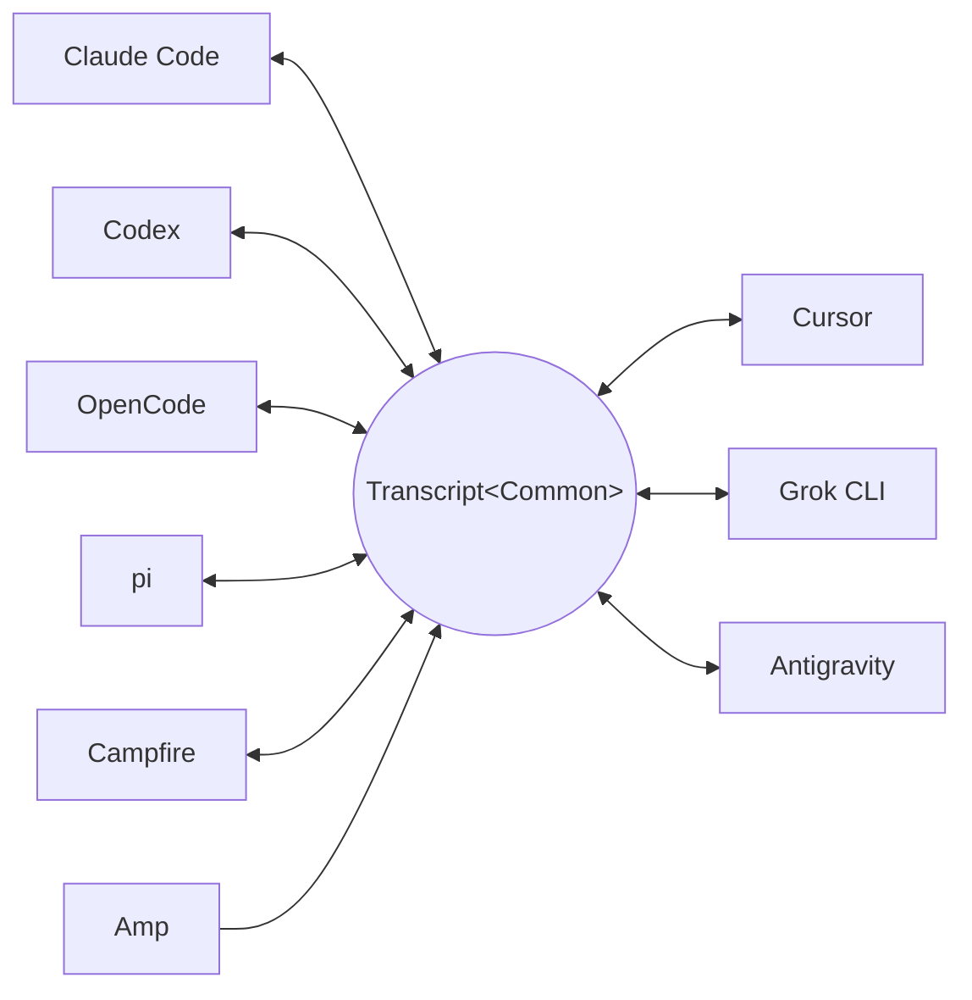

<p align="center">
  <picture>
    <source media="(prefers-color-scheme: dark)" srcset="docs/assets/wordmark-dark.svg">
    
  </picture>
</p>

<p align="center">Konvertiere Session-Transkripte von Coding-Agents zwischen Harness-Formaten — und setze jede Session in jedem Harness fort.</p>

<p align="center">
  <a href="README.md">English</a> | <a href="README.ja.md">日本語</a> | <a href="README.zh-CN.md">简体中文</a> | <a href="README.zh-TW.md">繁體中文</a> | <a href="README.ko.md">한국어</a> | Deutsch | <a href="README.es.md">Español</a> | <a href="README.fr.md">Français</a> | <a href="README.it.md">Italiano</a> | <a href="README.pt-BR.md">Português (Brasil)</a> | <a href="README.ru.md">Русский</a>
</p>

<p align="center">
  <a href="https://crates.io/crates/txcript"></a>
  <a href="https://www.npmjs.com/package/txcript"></a>
  <a href="https://docs.rs/txcript"></a>
  <a href="https://github.com/skillsynchq/txcript/actions/workflows/ci.yml"></a>
  <a href="LICENSE"></a>
</p>

<p align="center">
  <a href="https://claude.com/claude-code"></a>
  &nbsp;&nbsp;&nbsp;&nbsp;&nbsp;&nbsp;
  <a href="https://github.com/openai/codex"></a>
  &nbsp;&nbsp;&nbsp;&nbsp;&nbsp;&nbsp;
  <a href="https://opencode.ai"></a>
  &nbsp;&nbsp;&nbsp;&nbsp;&nbsp;&nbsp;
  <a href="https://pi.dev"></a>
  &nbsp;&nbsp;&nbsp;&nbsp;&nbsp;&nbsp;
  <a href="https://cursor.com"></a>
</p>

Starte eine Session in Claude Code, stoße an ein Nutzungslimit oder komm nicht
weiter — und setze sie in Codex fort, mit vollständiger Konversation,
Reasoning und Tool-Historie:

```console
$ txcript list
  claude_code   2h ago   fix relay reconnect bug          9f3a21…
  codex         1d ago   wire up usage accounting         c41b8d…
  opencode      3d ago   migrate store to sqlite          77e0f2…

$ txcript continue 9f3a21 --with codex    # re-synthesize into Codex, then launch it
```

txcript bildet das native Transkriptformat jedes Harness über ein typisiertes
gemeinsames Modell ab. Natives Laden/Speichern ist byte-verlustfrei; die
Konvertierung zwischen Harnesses erhält Nachrichten, Reasoning, Tool-Aufrufe,
Tool-Ergebnisse, Bilder, Metadaten und Usage-Daten, soweit verfügbar. txcript
wird als **Rust-Bibliothek**, als **CLI** und als vorgebautes **WASM-Modul**
für Bun, Node und Browser ausgeliefert.

## Highlights

- **9 Harnesses, ein Modell** — jedes Format wird über `Transcript<Common>`
  konvertiert; ein neu hinzugefügter Harness ist damit sofort mit allen
  anderen verbunden.
- **Byte-verlustfreie Round-Trips** — eine Session im eigenen Format zu laden
  und zu speichern reproduziert sie exakt.
- **Überall fortsetzen** — `txcript continue <id> --with <harness>` schreibt
  eine Session in das native Format eines anderen Harness um und startet ihn.
  Das Original wird nie verändert.
- **Alles durchsuchen** — Fuzzy-/Substring-Suche über alle Sessions auf dem
  Rechner (fzf-artige Syntax, angetrieben von [nucleo](https://github.com/helix-editor/nucleo)),
  als Bibliotheks-API, als einmalige CLI-Abfrage oder als interaktiver Picker.
- **MCP-Server** — `txcript mcp` stellt die schreibgeschützten Tools
  `list_sessions`, `search_sessions` und `read_session` bereit, sodass Agents
  vergangene Sessions als Kontext auswerten können.
- **Dokumentierte Formate** — das On-Disk-Format jedes Harness ist in
  [`docs/formats/`](docs/formats) beschrieben, mit Provenienz für jede Aussage
  (offizielle Dokumentation, Quellcode-Permalinks oder
  Reverse-Engineering-Notizen).

## Unterstützte Harnesses

Jeder Harness konvertiert über dasselbe kanonische Modell; ein neu
hinzugefügter Harness ist damit sofort mit allen anderen verbunden:



Discovery, Auflistung, Suche, `view` und byte-verlustfreie native Round-Trips
funktionieren für alle neun. Die String-Ids sind das, was CLI und WASM-APIs
entgegennehmen.

| Harness | id | Sessions auf der Festplatte | Natives Format | Konvertieren | Fortsetzen in | Doku |
|---|---|---|---|:---:|:---:|---|
| [Claude Code](https://claude.com/claude-code) | `claude_code` | `~/.claude/projects/` | JSONL | ⇄ | ✓ | [Spec](docs/formats/claude-code.md) |
| [Codex](https://github.com/openai/codex) | `codex` | `~/.codex/sessions/` | Rollout-JSONL | ⇄ | ✓ | [Spec](docs/formats/codex.md) |
| [OpenCode](https://opencode.ai) | `opencode` | `~/.local/share/opencode/opencode.db` | SQLite | ⇄ | ✓ | [Spec](docs/formats/opencode.md) |
| [pi](https://pi.dev) | `pi` | `~/.pi/agent/sessions/` | JSONL | ⇄ | ✓ | [Spec](docs/formats/pi.md) |
| Campfire | `campfire` | `~/.campfire/agent/sessions/` | JSONL | ⇄ | ✓ | [Spec](docs/formats/campfire.md) |
| [Cursor](https://cursor.com) | `cursor` | `~/.cursor/chats/` | SQLite (`store.db`) | ⇄ | ✓ | [Spec](docs/formats/cursor.md) |
| [Grok CLI](https://github.com/xai-org/grok-build) | `grok` | `~/.grok/sessions/` | Session-Verzeichnis (JSON) | ⇄ | ✓ | [Spec](docs/formats/grok.md) |
| [Amp](https://ampcode.com) | `amp` | `~/.local/share/amp/threads/` | Thread-JSON | → | — <sup>1</sup> | [Spec](docs/formats/amp.md) |
| [Antigravity](https://antigravity.google) | `antigravity` | `~/.gemini/antigravity-cli/` | SQLite (protobuf) | ⇄ | ✓ | [Spec](docs/formats/antigravity.md) |

<sup>1</sup> Amp-Threads liegen serverseitig, und die CLI hat keinen Import:
Sessions lassen sich *aus* Amp konvertieren, aber nicht in Amp fortsetzen.

## Installation

**CLI** (installiert das Binary `txcript`):

```sh
cargo install --git https://github.com/skillsynchq/txcript txcript-cli
# or from a checkout: cargo install --path cli
```

**Rust-Bibliothek**:

```sh
cargo add txcript
```

**JS / TS** (vorgebautes WASM, keine Rust-Toolchain nötig):

```sh
bun add txcript     # or: npm install txcript
```

## CLI

Lokale Sessions entdecken und eine davon in einem beliebigen Harness fortsetzen:

```sh
txcript list                             # local sessions across every harness
txcript continue <id>[#range]            # continue <id>, then launch its harness
    [--with <harness>]                    #   ...continuing in <harness> instead
    [--from <harness>]                    #   scope the id lookup to one harness
    [--out <dir>]                         #   write under <dir>; implies --no-resume
    [--no-resume]                         #   write the session but don't launch
txcript view <id>[#range]                # print a session as compact text
    [--from <harness>]                    #   scope the id lookup to one harness
```

`continue` übergibt das Terminal am Ende an den Harness (unter Unix per
`exec`). Wird im selben Harness fortgesetzt, wird das Original an Ort und
Stelle wiederaufgenommen; `--with` synthetisiert die Session zuerst in das
native Format eines anderen Harness. Ein Harness-übergreifendes `continue`
lässt die Original-Session dort, wo sie war — geschrieben wird immer eine
Kopie; die Quelle wird nie verändert oder entfernt. Der Startbefehl lässt sich
pro Harness mit `TRANSCRIPT_<HARNESS>_RESUME_CMD` (ein `{id}`-Template)
überschreiben, z. B. `TRANSCRIPT_CODEX_RESUME_CMD="codex resume {id}"`.

`view` gibt eine token-sparsame Textprojektion aus, in der eine
`── #N ──`-Linie jede Nachricht nummeriert. `#range` bezeichnet einen
1-basierten, inklusiven Nachrichtenbereich — `abc#7` ist Nachricht 7,
`abc#5-12`, `abc#5-` (ab 5), `abc#-10` (bis 10) — und die ausgegebenen
Ordinalzahlen sind genau die, die Bereiche verwenden: Was du siehst, ist das,
worauf du dich beziehst. `continue` akzeptiert dasselbe Suffix und setzt nur
diese Nachrichten als neue Session fort; Bereiche, die einen Tool-Aufruf von
seinem Ergebnis trennen, werden abgelehnt, mit dem nächstgelegenen gültigen
Bereich als Vorschlag.

### Suche

```sh
txcript query 'relay bug'                # one-shot: ranked hits, highlighted
txcript query                            # fzf-style picker; Enter continues
    [--from <harness>]                   #   search only <harness> (default: all)
    [--with <harness>]                   #   continue the pick in <harness>
```

Der Picker kommt ohne Abhängigkeiten aus (Raw-Mode-ANSI): Tippen filtert mit
fzf-artiger Fuzzy-Syntax, Pfeiltasten / ctrl-p/n bewegen die Auswahl, Enter
setzt die Auswahl im eigenen Harness fort (oder per `--with`), Esc bricht ab.
Jede Zeile zeigt, welche Art von Inhalt getroffen hat — User-Text,
Assistant-Text, Thinking, Tool-Nutzung, Tool-Ausgabe oder Session-Metadaten.

### MCP-Server

```sh
txcript mcp                              # stdio transport
```

Stellt genau drei schreibgeschützte Tools bereit; ihre optionalen Filter
entsprechen der CLI:

- `list_sessions(from?, cwd?)`
- `search_sessions(pattern, from?, cwd?)`
- `read_session(id, from?)`

Ohne `from` werden alle Harnesses einbezogen. Ohne `cwd` wird kein
Verzeichnisfilter angewandt, auch Sessions ohne aufgezeichnetes
Arbeitsverzeichnis sind enthalten; ist `cwd` gesetzt, matchen diese Sessions
nicht.

### Shell-Completions

```sh
txcript completion zsh > ~/.zfunc/_txcript      # or wherever your fpath looks
source <(txcript completion bash)               # bash, ad hoc
txcript completion fish > ~/.config/fish/completions/txcript.fish
```

## Rust-Bibliothek

```toml
[dependencies]
txcript = "0.5"
# Drops the OpenCode SQLite store (rusqlite); the OpenCode codec stays available.
# txcript = { version = "0.5", default-features = false }
```

Drei Schichten, von der kleinsten zur größten:

- `Codec` — `to_common` / `from_common` pro Harness; `convert::<A, B>`
  verkettet sie über das kanonische Modell.
- `TextCodec` — `from_text` / `to_text`: parst/rendert den nativen
  Session-Text eines Harness, ohne I/O.
- `Store` — Discover/Load/Save gegen ein echtes Backend
  (Session-Verzeichnisse oder SQLite-Datenbanken für OpenCode und Cursor).

Im Speicher konvertieren (ohne Dateisystem):

```rust
use txcript::harness::{claude_code, codex};
use txcript::{Codec, TextCodec, convert};

let claude = claude_code::ClaudeCode::from_text(jsonl_text)?;          // Transcript<ClaudeCode>
let codex = convert::<claude_code::ClaudeCode, codex::Codex>(&claude)?; // Transcript<Codex>
let codex_text = codex::Codex::to_text(&codex)?;                       // native rollout JSONL
```

Oder über die Festplatte mit einem `Store`:

```rust
use txcript::harness::{claude_code, codex};
use txcript::{Store, convert};

let store = claude_code::ClaudeStore::default_root().expect("home dir");
let found = store.discover()?;                       // cheap metadata scan
let claude = store.load(&found[0].reference)?;       // Transcript<ClaudeCode>

let codex = convert::<_, codex::Codex>(&claude)?;
codex::CodexStore::default_root().expect("home dir").save(&codex)?;  // resumable on disk
```

Das kanonische Modell ist `Transcript<Common>` — `Meta` + `Vec<Message>`,
wobei eine `Message` typisierte `Block`s enthält (`Text`, `Thinking`,
`ToolUse`, `ToolResult`, `Image`) sowie ein typisiertes `Tool`-Enum.

Ein Slash-Command, den der User im Harness ausgeführt hat, ist ein
`Tool::Command` auf einem User-Turn, mit dem, was der Harness zurückgegeben
hat, als gepaartem `ToolResult` — `/release patch` liest sich also als Aufruf
und nicht als das Markup, in dem der Harness ihn zufällig aufzeichnet. Das
führende `/` ist das kanonische Erkennungszeichen: Kein modellseitiger
Tool-Name beginnt damit. Boilerplate, das der Harness von selbst neu erzeugt
(der Local-Command-Hinweis von Claude Code), überlebt nicht ins Modell.

### Suche (Feature `search`, standardmäßig aktiviert)

`txcript::search` unterstützt Fuzzy- und Substring-Suche über Transkripte via
[nucleo](https://github.com/helix-editor/nucleo). Einmalige Suche:

```rust
use txcript::search::{Query, search};

let hits = search(&common, &Query::fuzzy("relay bug"));   // fzf syntax: 'exact ^prefix !not
for hit in hits {
    // hit.origin: User | Assistant | Thinking | ToolUse | ToolResult | Meta
    // hit.span addresses the message; hit.highlights are char ranges into hit.line
    let messages = common.fragment(&hit.span);            // zero-copy: Option<&[Message]>
}
```

Für Picker-artige Suche wird einmal ein `Index` aufgebaut und pro Tastendruck
abgefragt:

```rust
use txcript::search::{DocKey, Index, Query};

let mut index = Index::new();
index.insert(DocKey { harness, id }, &common);   // re-insert replaces; caller owns refresh
let matches = index.query(&Query::fuzzy("srch")); // ranked docs, best lines as hits
```

Ein leeres Pattern liefert Dokumente, neueste zuerst. Tool-Ausgaben sind
standardmäßig ausgeschlossen; mit `Origin::ALL` werden sie einbezogen.
`Query.harnesses`, `Query.limit` und `Query.hits_per_doc` grenzen die
Ergebnisse ein.

### Textprojektion

`txcript::text::to_text(&common)` ist eine einseitige, token-sparsame
Projektion von `Transcript<Common>` zur Verwendung als LLM-Kontext. Sie
behält Nachrichten, Reasoning-Text und kompakte Tool-Aufrufe/-Ergebnisse und
lässt Replay-only-Payloads wie verschlüsseltes Reasoning, Usage-Accounting
und eingebettete Bildbytes weg. `to_text_fragment(&common, &span)` rendert
einen `Span` des Bodys im selben Format, mit `── #N ──`-Linien, die die
1-basierte Ordinalzahl jeder Nachricht in der vollständigen Session tragen —
die Nummerierung, die `txcript view` ausgibt.

## WASM-Modul (Bun / Node / Browser)

Der reine Codec kompiliert zu WebAssembly; der JS-Host übernimmt sämtliches
I/O und ruft nur für die Transformation hinein. Die `Store`-Schicht
(Dateisystem, SQLite, Subprozesse) bleibt nativ und ist vom WASM-Build
ausgeschlossen. Das npm-Paket enthält das WASM vorgebaut:

```sh
bun add txcript     # or: npm install txcript
```

```ts
import { convert, toCommon, fromCommon, harnesses } from "txcript";
import { readFileSync, writeFileSync } from "node:fs";

const input = readFileSync("rollout.jsonl", "utf8");

// native -> native (e.g. a Codex rollout into Claude Code's JSONL)
writeFileSync("session.jsonl", convert(input, "codex", "claude_code"));

// canonical view, and back
const common = JSON.parse(toCommon(input, "codex"));   // { meta, messages }
const pi = fromCommon(JSON.stringify(common), "pi");

harnesses(); // ["claude_code","codex","opencode","pi","campfire","cursor","grok","amp","antigravity"]
```

Text rein / Text raus: `input` ist der native Session-Text eines Harness
(JSONL für claude_code/codex/pi/campfire, das `opencode export`-JSON für
opencode, ein JSON-Export von Cursors `store.db` für cursor, ein JSON-Bundle
der Dateien des Session-Verzeichnisses für grok, das Thread-JSON-Dokument —
die `amp threads export`-Form — für amp und ein JSON-Dump der
Konversationsdatenbank — hex-codierte Protobuf-Step-Blobs — für antigravity);
das Ergebnis ist der native Text des Ziels. Ungültige Harness-Namen oder
nicht parsbare Eingaben werfen einen JS-`Error`.

Um das WASM stattdessen aus dem Quellcode zu bauen:

```sh
git clone https://github.com/skillsynchq/txcript.git
cd txcript
bun run setup        # once: wasm target + wasm-bindgen-cli
bun run build        # produces ./pkg
```

## Formatdokumentation

Nicht alle dieser Transkriptformate sind von ihren Anbietern dokumentiert.
[`docs/formats/`](docs/formats) enthält ein Dokument pro Harness — wo
Sessions auf der Festplatte liegen, wie die Discovery sie findet, eine
Sezierung jedes Teils des Formats und seine Eigenheiten — jeweils versehen
mit der Provenienz des Behaupteten: offizielle Dokumentation, der eigene
Open-Source-Serialisierungscode des Harness (zitiert mit commit-gepinnten
Permalinks) oder Reverse Engineering.

## Entwicklung

```sh
cargo test                                          # native suite
cargo test --no-default-features                    # without the SQLite store
bun run build && bun examples/convert.ts <file> <from> <to>
```

Das Binary lebt in einem eigenen Workspace-Crate (`cli/`, Paket
`txcript-cli`), damit seine Abhängigkeiten (clap) Bibliotheksnutzer nie
berühren.

## Lizenz

[Apache-2.0](LICENSE)
