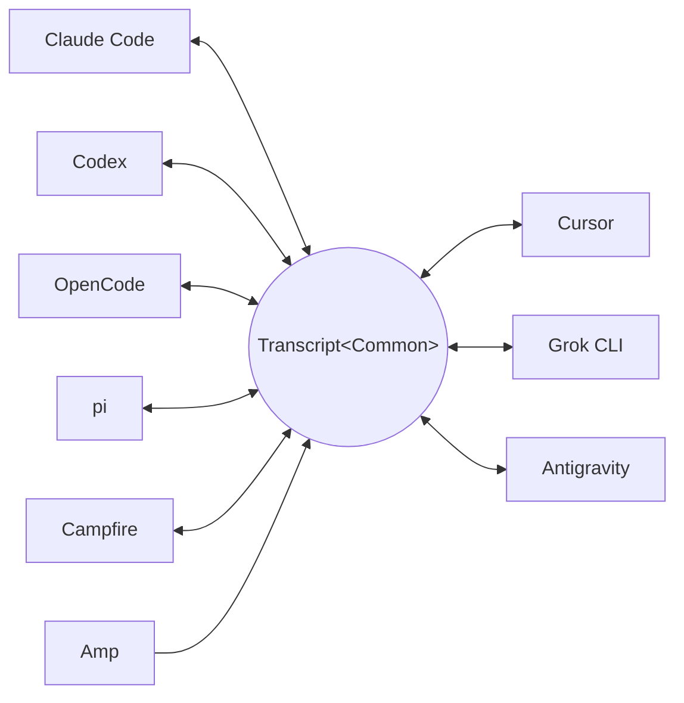

<p align="center">
  <picture>
    <source media="(prefers-color-scheme: dark)" srcset="docs/assets/wordmark-dark.svg">
    
  </picture>
</p>

<p align="center">Una biblioteca para mover sesiones entre agentes de código</p>

<p align="center">
  <a href="README.md">English</a> | <a href="README.ja.md">日本語</a> | <a href="README.zh-CN.md">简体中文</a> | <a href="README.zh-TW.md">繁體中文</a> | <a href="README.ko.md">한국어</a> | <a href="README.de.md">Deutsch</a> | Español | <a href="README.fr.md">Français</a> | <a href="README.it.md">Italiano</a> | <a href="README.pt-BR.md">Português (Brasil)</a> | <a href="README.ru.md">Русский</a>
</p>

<p align="center">
  <a href="https://crates.io/crates/txcript"></a>
  <a href="https://www.npmjs.com/package/txcript"></a>
  <a href="https://docs.rs/txcript"></a>
  <a href="https://github.com/skillsynchq/txcript/actions/workflows/ci.yml"></a>
  <a href="LICENSE"></a>
</p>

<p align="center">
  <a href="https://claude.com/claude-code"></a>
  &nbsp;&nbsp;&nbsp;&nbsp;&nbsp;&nbsp;
  <a href="https://github.com/openai/codex"></a>
  &nbsp;&nbsp;&nbsp;&nbsp;&nbsp;&nbsp;
  <a href="https://opencode.ai"></a>
  &nbsp;&nbsp;&nbsp;&nbsp;&nbsp;&nbsp;
  <a href="https://pi.dev"></a>
  &nbsp;&nbsp;&nbsp;&nbsp;&nbsp;&nbsp;
  <a href="https://cursor.com"></a>
</p>

Empieza una sesión en Claude Code, topa con un límite de uso o un callejón sin
salida, y retómala en Codex — con toda la conversación, el razonamiento y el
historial de herramientas intactos:

```console
$ txcript list
  claude_code   2h ago   fix relay reconnect bug          9f3a21…
  codex         1d ago   wire up usage accounting         c41b8d…
  opencode      3d ago   migrate store to sqlite          77e0f2…

$ txcript continue 9f3a21 --with codex    # re-synthesize into Codex, then launch it
```

txcript mapea el formato nativo de transcripción de cada harness a través de un
modelo común tipado. La carga/guardado nativo es sin pérdida a nivel de bytes;
la conversión entre harnesses preserva mensajes, razonamiento, llamadas a
herramientas, resultados de herramientas, imágenes, metadatos y uso cuando
están disponibles. Se distribuye como **biblioteca Rust**, **CLI** y un módulo
**WASM** precompilado para Bun, Node y navegadores.

## Puntos destacados

- **9 harnesses, un solo modelo** — cada formato se convierte a través de
  `Transcript<Common>`, así que añadir un harness lo conecta con todos los demás.
- **Ida y vuelta sin pérdida a nivel de bytes** — cargar y guardar una sesión en
  su propio formato la reproduce exactamente.
- **Continúa donde quieras** — `txcript continue <id> --with <harness>` reescribe
  una sesión al formato nativo de otro harness y lo lanza. El original nunca
  se modifica.
- **Busca en todo** — búsqueda difusa/por subcadena en todas las sesiones de la
  máquina (sintaxis estilo fzf, impulsada por [nucleo](https://github.com/helix-editor/nucleo)),
  como API de biblioteca, consulta puntual desde la CLI o selector interactivo.
- **Servidor MCP** — `txcript mcp` expone las herramientas de solo lectura
  `list_sessions`, `search_sessions` y `read_session`, para que los agentes
  puedan explotar sesiones pasadas como contexto.
- **Formatos documentados** — el formato en disco de cada harness está descrito
  en [`docs/formats/`](docs/formats), con la procedencia de cada afirmación
  (documentación oficial, permalinks al código fuente o notas de ingeniería
  inversa).

## Harnesses compatibles

Cada harness se convierte a través del mismo modelo canónico, así que añadir
uno lo conecta con todos los demás:



El descubrimiento, el listado, la búsqueda, `view` y las idas y vueltas
nativas sin pérdida a nivel de bytes funcionan para los nueve. Los ids de
cadena son los que aceptan la CLI y las APIs de WASM.

| Harness | id | Sesiones en disco | Formato nativo | Conversión | Continuar hacia | Doc |
|---|---|---|---|:---:|:---:|---|
| [Claude Code](https://claude.com/claude-code) | `claude_code` | `~/.claude/projects/` | JSONL | ⇄ | ✓ | [spec](docs/formats/claude-code.md) |
| [Codex](https://github.com/openai/codex) | `codex` | `~/.codex/sessions/` | rollout JSONL | ⇄ | ✓ | [spec](docs/formats/codex.md) |
| [OpenCode](https://opencode.ai) | `opencode` | `~/.local/share/opencode/opencode.db` | SQLite | ⇄ | ✓ | [spec](docs/formats/opencode.md) |
| [pi](https://pi.dev) | `pi` | `~/.pi/agent/sessions/` | JSONL | ⇄ | ✓ | [spec](docs/formats/pi.md) |
| Campfire | `campfire` | `~/.campfire/agent/sessions/` | JSONL | ⇄ | ✓ | [spec](docs/formats/campfire.md) |
| [Cursor](https://cursor.com) | `cursor` | `~/.cursor/chats/` | SQLite (`store.db`) | ⇄ | ✓ | [spec](docs/formats/cursor.md) |
| [Grok CLI](https://github.com/xai-org/grok-build) | `grok` | `~/.grok/sessions/` | directorio de sesión (JSON) | ⇄ | ✓ | [spec](docs/formats/grok.md) |
| [Amp](https://ampcode.com) | `amp` | `~/.local/share/amp/threads/` | JSON del hilo | → | — <sup>1</sup> | [spec](docs/formats/amp.md) |
| [Antigravity](https://antigravity.google) | `antigravity` | `~/.gemini/antigravity-cli/` | SQLite (protobuf) | ⇄ | ✓ | [spec](docs/formats/antigravity.md) |

<sup>1</sup> Los hilos de Amp residen en el servidor y la CLI no tiene
importación: las sesiones se convierten *desde* Amp, pero no pueden
continuarse en él.

## Instalación

**CLI** (instala el binario `txcript`):

```sh
cargo install --git https://github.com/skillsynchq/txcript txcript-cli
# or from a checkout: cargo install --path cli
```

**Biblioteca Rust**:

```sh
cargo add txcript
```

**JS / TS** (WASM precompilado, no requiere toolchain de Rust):

```sh
bun add txcript     # or: npm install txcript
```

## CLI

Descubre sesiones locales y continúa una en cualquier harness:

```sh
txcript list                             # local sessions across every harness
txcript continue <id>[#range]            # continue <id>, then launch its harness
    [--with <harness>]                    #   ...continuing in <harness> instead
    [--from <harness>]                    #   scope the id lookup to one harness
    [--out <dir>]                         #   write under <dir>; implies --no-resume
    [--no-resume]                         #   write the session but don't launch
txcript view <id>[#range]                # print a session as compact text
    [--from <harness>]                    #   scope the id lookup to one harness
```

`continue` cede la terminal al harness al terminar (en Unix hace `exec`).
Continuar en el mismo harness reanuda el original en su sitio; `--with`
re-sintetiza primero al formato nativo de otro harness. Un continue entre
harnesses deja la sesión original donde estaba — lo que se escribe es siempre
una copia; la fuente nunca se modifica ni se elimina. Sobrescribe el comando
de lanzamiento por harness con `TRANSCRIPT_<HARNESS>_RESUME_CMD` (una
plantilla con `{id}`), p. ej.
`TRANSCRIPT_CODEX_RESUME_CMD="codex resume {id}"`.

`view` imprime una proyección de texto que economiza tokens, con una regla
`── #N ──` que numera cada mensaje. `#range` designa un rango de mensajes
inclusivo con base 1 — `abc#7` es el mensaje 7, `abc#5-12`, `abc#5-` (del 5 en
adelante), `abc#-10` (hasta el 10) — y los ordinales impresos son los que usan
los rangos, así que lo que ves es lo que referencias. `continue` acepta el
mismo sufijo y continúa solo esos mensajes como una sesión nueva; los rangos
que separan una llamada a herramienta de su resultado se rechazan, sugiriendo
el rango válido más cercano.

### Búsqueda

```sh
txcript query 'relay bug'                # one-shot: ranked hits, highlighted
txcript query                            # fzf-style picker; Enter continues
    [--from <harness>]                   #   search only <harness> (default: all)
    [--with <harness>]                   #   continue the pick in <harness>
```

El selector no tiene dependencias (ANSI en modo raw): escribe para filtrar con
sintaxis difusa estilo fzf, flechas / ctrl-p/n para moverte, Enter para
continuar la selección en su propio harness (o `--with`), Esc para cancelar.
Cada fila muestra qué tipo de contenido coincidió — texto del usuario, texto
del asistente, razonamiento, uso de herramientas, salida de herramientas o
metadatos de la sesión.

### Servidor MCP

```sh
txcript mcp                              # stdio transport
```

Expone exactamente tres herramientas de solo lectura; sus filtros opcionales
coinciden con los de la CLI:

- `list_sessions(from?, cwd?)`
- `search_sessions(pattern, from?, cwd?)`
- `read_session(id, from?)`

Omitir `from` incluye todos los harnesses. Omitir `cwd` no aplica ningún filtro
de directorio, incluyendo las sesiones sin directorio de trabajo registrado;
cuando `cwd` está presente, esas sesiones no coinciden.

### Autocompletado de shell

```sh
txcript completion zsh > ~/.zfunc/_txcript      # or wherever your fpath looks
source <(txcript completion bash)               # bash, ad hoc
txcript completion fish > ~/.config/fish/completions/txcript.fish
```

## Biblioteca Rust

```toml
[dependencies]
txcript = "0.5"
# Drops the OpenCode SQLite store (rusqlite); the OpenCode codec stays available.
# txcript = { version = "0.5", default-features = false }
```

Tres capas, de menor a mayor:

- `Codec` — `to_common` / `from_common` por harness; `convert::<A, B>` los
  encadena a través del modelo canónico.
- `TextCodec` — `from_text` / `to_text`: parsea/renderiza el texto de sesión
  nativo de un harness, sin I/O.
- `Store` — descubre/carga/guarda contra un backend real (directorios de
  sesiones, o bases de datos SQLite para OpenCode y Cursor).

Convierte en memoria (sin sistema de archivos):

```rust
use txcript::harness::{claude_code, codex};
use txcript::{Codec, TextCodec, convert};

let claude = claude_code::ClaudeCode::from_text(jsonl_text)?;          // Transcript<ClaudeCode>
let codex = convert::<claude_code::ClaudeCode, codex::Codex>(&claude)?; // Transcript<Codex>
let codex_text = codex::Codex::to_text(&codex)?;                       // native rollout JSONL
```

O pasa por disco con un `Store`:

```rust
use txcript::harness::{claude_code, codex};
use txcript::{Store, convert};

let store = claude_code::ClaudeStore::default_root().expect("home dir");
let found = store.discover()?;                       // cheap metadata scan
let claude = store.load(&found[0].reference)?;       // Transcript<ClaudeCode>

let codex = convert::<_, codex::Codex>(&claude)?;
codex::CodexStore::default_root().expect("home dir").save(&codex)?;  // resumable on disk
```

El modelo canónico es `Transcript<Common>` — `Meta` + `Vec<Message>`, donde un
`Message` contiene `Block`s tipados (`Text`, `Thinking`, `ToolUse`,
`ToolResult`, `Image`) y un enum `Tool` tipado.

Un slash command que el usuario ejecutó en el harness es un `Tool::Command` en
un turno de usuario, con lo que el harness haya devuelto como el `ToolResult`
emparejado — de modo que `/release patch` se lee como una llamada y no como el
markup en el que el harness casualmente lo registra. La `/` inicial es lo que
lo marca canónicamente: ningún nombre de herramienta visible para el modelo la
lleva. El texto repetitivo que el harness regenera por su cuenta (la
advertencia de comando local de Claude Code) no sobrevive en el modelo.

### Búsqueda (feature `search`, activada por defecto)

`txcript::search` soporta búsqueda difusa y por subcadena sobre transcripciones
mediante [nucleo](https://github.com/helix-editor/nucleo). Búsqueda puntual:

```rust
use txcript::search::{Query, search};

let hits = search(&common, &Query::fuzzy("relay bug"));   // fzf syntax: 'exact ^prefix !not
for hit in hits {
    // hit.origin: User | Assistant | Thinking | ToolUse | ToolResult | Meta
    // hit.span addresses the message; hit.highlights are char ranges into hit.line
    let messages = common.fragment(&hit.span);            // zero-copy: Option<&[Message]>
}
```

Para búsquedas tipo selector, construye un `Index` una vez y consúltalo con
cada pulsación de tecla:

```rust
use txcript::search::{DocKey, Index, Query};

let mut index = Index::new();
index.insert(DocKey { harness, id }, &common);   // re-insert replaces; caller owns refresh
let matches = index.query(&Query::fuzzy("srch")); // ranked docs, best lines as hits
```

Un patrón vacío devuelve los documentos ordenados del más reciente al más
antiguo. Las salidas de herramientas se excluyen por defecto; usa
`Origin::ALL` para incluirlas. `Query.harnesses`, `Query.limit` y
`Query.hits_per_doc` acotan los resultados.

### Proyección de texto

`txcript::text::to_text(&common)` es una proyección unidireccional de
`Transcript<Common>` que economiza tokens, pensada como contexto para LLMs.
Conserva los mensajes, el texto de razonamiento y llamadas/resultados de
herramientas compactos, omitiendo cargas útiles solo de reproducción como el
razonamiento cifrado, la contabilidad de uso y los bytes de imágenes en línea.
`to_text_fragment(&common, &span)` renderiza un `Span` del cuerpo en el mismo
formato, con reglas `── #N ──` que llevan el ordinal con base 1 de cada
mensaje en la sesión completa — la numeración que imprime `txcript view`.

## Módulo WASM (Bun / Node / navegadores)

El codec puro compila a WebAssembly; el host JS es dueño de todo el I/O y llama
para la transformación. La capa `Store` (sistema de archivos, SQLite,
subprocesos) permanece nativa y queda excluida del build WASM. El paquete npm
incluye el wasm precompilado:

```sh
bun add txcript     # or: npm install txcript
```

```ts
import { convert, toCommon, fromCommon, harnesses } from "txcript";
import { readFileSync, writeFileSync } from "node:fs";

const input = readFileSync("rollout.jsonl", "utf8");

// native -> native (e.g. a Codex rollout into Claude Code's JSONL)
writeFileSync("session.jsonl", convert(input, "codex", "claude_code"));

// canonical view, and back
const common = JSON.parse(toCommon(input, "codex"));   // { meta, messages }
const pi = fromCommon(JSON.stringify(common), "pi");

harnesses(); // ["claude_code","codex","opencode","pi","campfire","cursor","grok","amp","antigravity"]
```

Texto de entrada / texto de salida: `input` es el texto de sesión nativo de un
harness (JSONL para claude_code/codex/pi/campfire, el JSON de
`opencode export` para opencode, un export JSON del `store.db` de Cursor para
cursor, un bundle JSON de los archivos del directorio de sesión para grok, el
documento JSON del hilo — la forma de `amp threads export` — para amp, y un
volcado JSON de la base de datos de conversaciones — blobs de pasos protobuf
codificados en hexadecimal — para antigravity); el resultado es el texto
nativo del destino. Los nombres de harness inválidos o la entrada no
parseable lanzan un `Error` de JS.

Para compilar el wasm desde el código fuente:

```sh
git clone https://github.com/skillsynchq/txcript.git
cd txcript
bun run setup        # once: wasm target + wasm-bindgen-cli
bun run build        # produces ./pkg
```

## Documentación de formatos

No todos estos formatos de transcripción están documentados por sus
proveedores. [`docs/formats/`](docs/formats) tiene un documento por harness —
dónde viven las sesiones en disco, cómo las encuentra el descubrimiento, una
disección de cada parte del formato y sus particularidades — cada uno
etiquetado con la procedencia de lo que afirma: documentación oficial, el
propio código de serialización open source del harness (citado con permalinks
fijados a un commit) o ingeniería inversa.

## Desarrollo

```sh
cargo test                                          # native suite
cargo test --no-default-features                    # without the SQLite store
bun run build && bun examples/convert.ts <file> <from> <to>
```

El binario vive en su propio crate del workspace (`cli/`, paquete
`txcript-cli`) para que sus dependencias (clap) nunca afecten a los
consumidores de la biblioteca.

## Licencia

[Apache-2.0](LICENSE)
