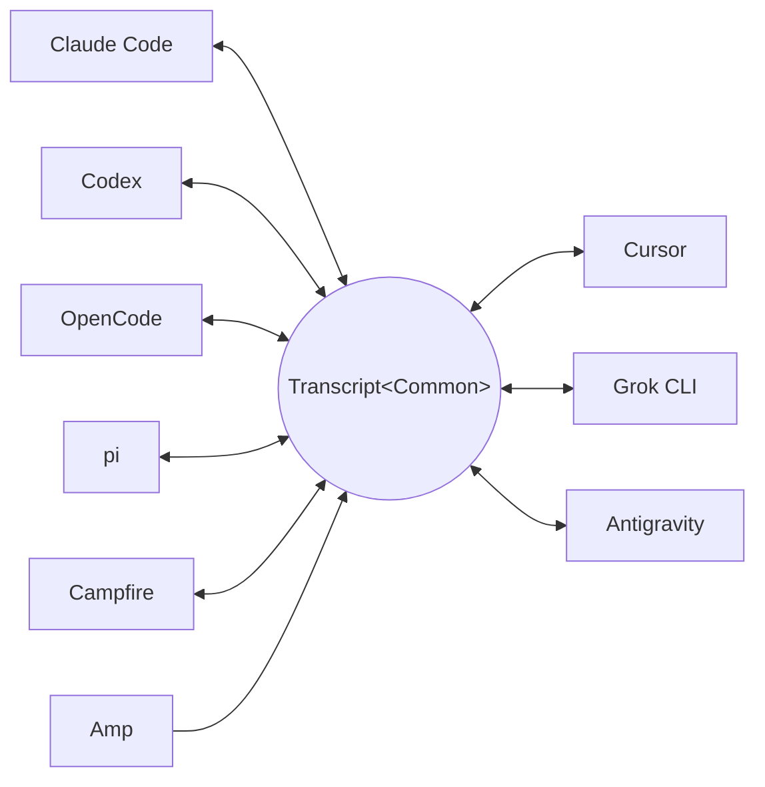

<p align="center">
  <picture>
    <source media="(prefers-color-scheme: dark)" srcset="docs/assets/wordmark-dark.svg">
    
  </picture>
</p>

<p align="center">Convertissez les transcriptions de sessions d'agents de code entre formats de harness — et poursuivez n'importe quelle session dans n'importe quel harness.</p>

<p align="center">
  <a href="README.md">English</a> | <a href="README.ja.md">日本語</a> | <a href="README.zh-CN.md">简体中文</a> | <a href="README.zh-TW.md">繁體中文</a> | <a href="README.ko.md">한국어</a> | <a href="README.de.md">Deutsch</a> | <a href="README.es.md">Español</a> | Français | <a href="README.it.md">Italiano</a> | <a href="README.pt-BR.md">Português (Brasil)</a> | <a href="README.ru.md">Русский</a>
</p>

<p align="center">
  <a href="https://crates.io/crates/txcript"></a>
  <a href="https://www.npmjs.com/package/txcript"></a>
  <a href="https://docs.rs/txcript"></a>
  <a href="https://github.com/skillsynchq/txcript/actions/workflows/ci.yml"></a>
  <a href="LICENSE"></a>
</p>

<p align="center">
  <a href="https://claude.com/claude-code"></a>
  &nbsp;&nbsp;&nbsp;&nbsp;&nbsp;&nbsp;
  <a href="https://github.com/openai/codex"></a>
  &nbsp;&nbsp;&nbsp;&nbsp;&nbsp;&nbsp;
  <a href="https://opencode.ai"></a>
  &nbsp;&nbsp;&nbsp;&nbsp;&nbsp;&nbsp;
  <a href="https://pi.dev"></a>
  &nbsp;&nbsp;&nbsp;&nbsp;&nbsp;&nbsp;
  <a href="https://cursor.com"></a>
</p>

Démarrez une session dans Claude Code, atteignez une limite d'utilisation ou
une impasse, puis reprenez-la dans Codex — avec l'intégralité de la
conversation, du raisonnement et de l'historique des outils :

```console
$ txcript list
  claude_code   2h ago   fix relay reconnect bug          9f3a21…
  codex         1d ago   wire up usage accounting         c41b8d…
  opencode      3d ago   migrate store to sqlite          77e0f2…

$ txcript continue 9f3a21 --with codex    # re-synthesize into Codex, then launch it
```

txcript fait transiter le format de transcription natif de chaque harness par
un modèle commun typé. Le chargement/enregistrement natif est sans perte à
l'octet près ; la conversion entre harness préserve les messages, le
raisonnement, les appels d'outils, les résultats d'outils, les images, les
métadonnées et l'usage lorsqu'ils sont disponibles. Il est distribué sous
forme de **bibliothèque Rust**, de **CLI** et de module **WASM** précompilé
pour Bun, Node et les navigateurs.

## Points forts

- **9 harness, un seul modèle** — chaque format se convertit via
  `Transcript<Common>`, si bien qu'ajouter un harness le connecte à tous les
  autres.
- **Allers-retours sans perte à l'octet près** — charger puis enregistrer une
  session dans son propre format la reproduit à l'identique.
- **Continuez n'importe où** — `txcript continue <id> --with <harness>` réécrit
  une session dans le format natif d'un autre harness et le lance. L'original
  n'est jamais modifié.
- **Cherchez dans tout** — recherche floue/par sous-chaîne dans toutes les
  sessions de la machine (syntaxe façon fzf, propulsée par
  [nucleo](https://github.com/helix-editor/nucleo)), sous forme d'API de
  bibliothèque, de requête CLI ponctuelle ou de sélecteur interactif.
- **Serveur MCP** — `txcript mcp` expose les outils en lecture seule
  `list_sessions`, `search_sessions` et `read_session`, pour que les agents
  puissent exploiter les sessions passées comme contexte.
- **Formats documentés** — le format sur disque de chaque harness est décrit
  dans [`docs/formats/`](docs/formats), avec la provenance de chaque
  affirmation (documentation officielle, permaliens vers le code source ou
  notes de rétro-ingénierie).

## Harness pris en charge

Chaque harness se convertit via le même modèle canonique, si bien qu'en
ajouter un le connecte à tous les autres :



La découverte, le listage, la recherche, `view` et les allers-retours natifs
sans perte à l'octet près fonctionnent pour les neuf. Les ids sous forme de
chaîne sont ceux qu'acceptent la CLI et les API WASM.

| Harness | id | Sessions sur disque | Format natif | Conversion | Continuer vers | Doc |
|---|---|---|---|:---:|:---:|---|
| [Claude Code](https://claude.com/claude-code) | `claude_code` | `~/.claude/projects/` | JSONL | ⇄ | ✓ | [spec](docs/formats/claude-code.md) |
| [Codex](https://github.com/openai/codex) | `codex` | `~/.codex/sessions/` | rollout JSONL | ⇄ | ✓ | [spec](docs/formats/codex.md) |
| [OpenCode](https://opencode.ai) | `opencode` | `~/.local/share/opencode/opencode.db` | SQLite | ⇄ | ✓ | [spec](docs/formats/opencode.md) |
| [pi](https://pi.dev) | `pi` | `~/.pi/agent/sessions/` | JSONL | ⇄ | ✓ | [spec](docs/formats/pi.md) |
| Campfire | `campfire` | `~/.campfire/agent/sessions/` | JSONL | ⇄ | ✓ | [spec](docs/formats/campfire.md) |
| [Cursor](https://cursor.com) | `cursor` | `~/.cursor/chats/` | SQLite (`store.db`) | ⇄ | ✓ | [spec](docs/formats/cursor.md) |
| [Grok CLI](https://github.com/xai-org/grok-build) | `grok` | `~/.grok/sessions/` | répertoire de session (JSON) | ⇄ | ✓ | [spec](docs/formats/grok.md) |
| [Amp](https://ampcode.com) | `amp` | `~/.local/share/amp/threads/` | JSON de thread | → | — <sup>1</sup> | [spec](docs/formats/amp.md) |
| [Antigravity](https://antigravity.google) | `antigravity` | `~/.gemini/antigravity-cli/` | SQLite (protobuf) | ⇄ | ✓ | [spec](docs/formats/antigravity.md) |

<sup>1</sup> Les threads Amp sont côté serveur et la CLI n'a pas d'import :
les sessions se convertissent *depuis* Amp, mais ne peuvent pas y être
poursuivies.

## Installation

**CLI** (installe le binaire `txcript`) :

```sh
cargo install --git https://github.com/skillsynchq/txcript txcript-cli
# or from a checkout: cargo install --path cli
```

**Bibliothèque Rust** :

```sh
cargo add txcript
```

**JS / TS** (WASM précompilé, aucune toolchain Rust requise) :

```sh
bun add txcript     # or: npm install txcript
```

## CLI

Découvrez les sessions locales et poursuivez-en une dans n'importe quel
harness :

```sh
txcript list                             # local sessions across every harness
txcript continue <id>[#range]            # continue <id>, then launch its harness
    [--with <harness>]                    #   ...continuing in <harness> instead
    [--from <harness>]                    #   scope the id lookup to one harness
    [--out <dir>]                         #   write under <dir>; implies --no-resume
    [--no-resume]                         #   write the session but don't launch
txcript view <id>[#range]                # print a session as compact text
    [--from <harness>]                    #   scope the id lookup to one harness
```

`continue` cède le terminal au harness une fois terminé (sous Unix, il fait un
`exec`). Un continue dans le même harness reprend l'original en place ;
`--with` re-synthétise d'abord vers le format natif d'un autre harness. Un
continue inter-harness laisse la session d'origine là où elle était — ce qui
est écrit est toujours une copie ; la source n'est jamais modifiée ni
supprimée. Remplacez la commande de lancement par harness avec
`TRANSCRIPT_<HARNESS>_RESUME_CMD` (un gabarit avec `{id}`), p. ex.
`TRANSCRIPT_CODEX_RESUME_CMD="codex resume {id}"`.

`view` imprime une projection texte économe en tokens, avec un filet
`── #N ──` numérotant chaque message. `#range` désigne une plage de messages
inclusive à base 1 — `abc#7` est le message 7, `abc#5-12`, `abc#5-` (à partir
du 5), `abc#-10` (jusqu'au 10) — et les ordinaux imprimés sont ceux
qu'utilisent les plages, donc ce que vous voyez est ce que vous référencez.
`continue` accepte le même suffixe et poursuit uniquement ces messages en tant
que nouvelle session ; les plages qui séparent un appel d'outil de son
résultat sont refusées, avec la plage valide la plus proche en suggestion.

### Recherche

```sh
txcript query 'relay bug'                # one-shot: ranked hits, highlighted
txcript query                            # fzf-style picker; Enter continues
    [--from <harness>]                   #   search only <harness> (default: all)
    [--with <harness>]                   #   continue the pick in <harness>
```

Le sélecteur est sans dépendances (ANSI en mode raw) : tapez pour filtrer avec
la syntaxe floue façon fzf, flèches / ctrl-p/n pour naviguer, Entrée pour
poursuivre la sélection dans son propre harness (ou `--with`), Échap pour
annuler. Chaque ligne indique le type de contenu qui a correspondu — texte
utilisateur, texte assistant, raisonnement, usage d'outil, sortie d'outil ou
métadonnées de session.

### Serveur MCP

```sh
txcript mcp                              # stdio transport
```

Expose exactement trois outils en lecture seule ; leurs filtres optionnels
correspondent à ceux de la CLI :

- `list_sessions(from?, cwd?)`
- `search_sessions(pattern, from?, cwd?)`
- `read_session(id, from?)`

Omettre `from` inclut tous les harness. Omettre `cwd` n'applique aucun filtre
de répertoire, y compris pour les sessions sans répertoire de travail
enregistré ; quand `cwd` est présent, ces sessions ne correspondent pas.

### Complétions shell

```sh
txcript completion zsh > ~/.zfunc/_txcript      # or wherever your fpath looks
source <(txcript completion bash)               # bash, ad hoc
txcript completion fish > ~/.config/fish/completions/txcript.fish
```

## Bibliothèque Rust

```toml
[dependencies]
txcript = "0.5"
# Drops the OpenCode SQLite store (rusqlite); the OpenCode codec stays available.
# txcript = { version = "0.5", default-features = false }
```

Trois couches, de la plus petite à la plus grande :

- `Codec` — `to_common` / `from_common` par harness ; `convert::<A, B>` les
  enchaîne via le modèle canonique.
- `TextCodec` — `from_text` / `to_text` : parse/rend le texte de session natif
  d'un harness, sans I/O.
- `Store` — découvre/charge/enregistre contre un vrai backend (répertoires de
  sessions, ou bases SQLite pour OpenCode et Cursor).

Convertissez en mémoire (sans système de fichiers) :

```rust
use txcript::harness::{claude_code, codex};
use txcript::{Codec, TextCodec, convert};

let claude = claude_code::ClaudeCode::from_text(jsonl_text)?;          // Transcript<ClaudeCode>
let codex = convert::<claude_code::ClaudeCode, codex::Codex>(&claude)?; // Transcript<Codex>
let codex_text = codex::Codex::to_text(&codex)?;                       // native rollout JSONL
```

Ou passez par le disque avec un `Store` :

```rust
use txcript::harness::{claude_code, codex};
use txcript::{Store, convert};

let store = claude_code::ClaudeStore::default_root().expect("home dir");
let found = store.discover()?;                       // cheap metadata scan
let claude = store.load(&found[0].reference)?;       // Transcript<ClaudeCode>

let codex = convert::<_, codex::Codex>(&claude)?;
codex::CodexStore::default_root().expect("home dir").save(&codex)?;  // resumable on disk
```

Le modèle canonique est `Transcript<Common>` — `Meta` + `Vec<Message>`, où un
`Message` contient des `Block`s typés (`Text`, `Thinking`, `ToolUse`,
`ToolResult`, `Image`) et un enum `Tool` typé.

Une slash command que l'utilisateur a lancée dans le harness est un
`Tool::Command` sur un tour utilisateur, avec ce que le harness a renvoyé
comme `ToolResult` apparié — ainsi `/release patch` se lit comme un appel
plutôt que comme le balisage dans lequel le harness se trouve l'enregistrer.
Le `/` initial est ce qui le marque canoniquement : aucun nom d'outil visible
par le modèle n'en porte un. Le texte passe-partout que le harness régénère de
lui-même (l'avertissement de commande locale de Claude Code) ne survit pas
dans le modèle.

### Recherche (feature `search`, activée par défaut)

`txcript::search` prend en charge la recherche floue et par sous-chaîne sur
les transcriptions via [nucleo](https://github.com/helix-editor/nucleo).
Recherche ponctuelle :

```rust
use txcript::search::{Query, search};

let hits = search(&common, &Query::fuzzy("relay bug"));   // fzf syntax: 'exact ^prefix !not
for hit in hits {
    // hit.origin: User | Assistant | Thinking | ToolUse | ToolResult | Meta
    // hit.span addresses the message; hit.highlights are char ranges into hit.line
    let messages = common.fragment(&hit.span);            // zero-copy: Option<&[Message]>
}
```

Pour une recherche façon sélecteur, construisez un `Index` une fois et
interrogez-le à chaque frappe :

```rust
use txcript::search::{DocKey, Index, Query};

let mut index = Index::new();
index.insert(DocKey { harness, id }, &common);   // re-insert replaces; caller owns refresh
let matches = index.query(&Query::fuzzy("srch")); // ranked docs, best lines as hits
```

Un motif vide renvoie les documents du plus récent au plus ancien. Les sorties
d'outils sont exclues par défaut ; utilisez `Origin::ALL` pour les inclure.
`Query.harnesses`, `Query.limit` et `Query.hits_per_doc` restreignent les
résultats.

### Projection texte

`txcript::text::to_text(&common)` est une projection unidirectionnelle et
économe en tokens de `Transcript<Common>`, destinée à servir de contexte LLM.
Elle conserve les messages, le texte de raisonnement et des appels/résultats
d'outils compacts, en omettant les charges utiles réservées au rejeu comme le
raisonnement chiffré, la comptabilité d'usage et les octets d'images en ligne.
`to_text_fragment(&common, &span)` rend un `Span` du corps dans le même
format, avec des filets `── #N ──` portant l'ordinal à base 1 de chaque
message dans la session complète — la numérotation qu'imprime `txcript view`.

## Module WASM (Bun / Node / navigateurs)

Le codec pur compile en WebAssembly ; l'hôte JS possède tout l'I/O et appelle
pour la transformation. La couche `Store` (système de fichiers, SQLite,
sous-processus) reste native et est exclue du build WASM. Le paquet npm
embarque le wasm précompilé :

```sh
bun add txcript     # or: npm install txcript
```

```ts
import { convert, toCommon, fromCommon, harnesses } from "txcript";
import { readFileSync, writeFileSync } from "node:fs";

const input = readFileSync("rollout.jsonl", "utf8");

// native -> native (e.g. a Codex rollout into Claude Code's JSONL)
writeFileSync("session.jsonl", convert(input, "codex", "claude_code"));

// canonical view, and back
const common = JSON.parse(toCommon(input, "codex"));   // { meta, messages }
const pi = fromCommon(JSON.stringify(common), "pi");

harnesses(); // ["claude_code","codex","opencode","pi","campfire","cursor","grok","amp","antigravity"]
```

Texte en entrée / texte en sortie : `input` est le texte de session natif d'un
harness (JSONL pour claude_code/codex/pi/campfire, le JSON d'`opencode export`
pour opencode, un export JSON du `store.db` de Cursor pour cursor, un bundle
JSON des fichiers du répertoire de session pour grok, le document JSON du
thread — la forme d'`amp threads export` — pour amp, et un dump JSON de la
base de conversations — blobs d'étapes protobuf encodés en hexadécimal — pour
antigravity) ; le résultat est le texte natif de la cible. Les noms de harness
invalides ou une entrée non analysable lèvent une `Error` JS.

Pour compiler le wasm depuis les sources :

```sh
git clone https://github.com/skillsynchq/txcript.git
cd txcript
bun run setup        # once: wasm target + wasm-bindgen-cli
bun run build        # produces ./pkg
```

## Documentation des formats

Tous ces formats de transcription ne sont pas documentés par leurs éditeurs.
[`docs/formats/`](docs/formats) contient un document par harness — où les
sessions vivent sur disque, comment la découverte les trouve, une dissection
de chaque partie du format et ses particularités — chacun étiqueté avec la
provenance de ce qu'il affirme : documentation officielle, le propre code de
sérialisation open source du harness (cité avec des permaliens épinglés à un
commit) ou rétro-ingénierie.

## Développement

```sh
cargo test                                          # native suite
cargo test --no-default-features                    # without the SQLite store
bun run build && bun examples/convert.ts <file> <from> <to>
```

Le binaire vit dans son propre crate du workspace (`cli/`, paquet
`txcript-cli`) afin que ses dépendances (clap) ne touchent jamais les
consommateurs de la bibliothèque.

## Licence

[Apache-2.0](LICENSE)
