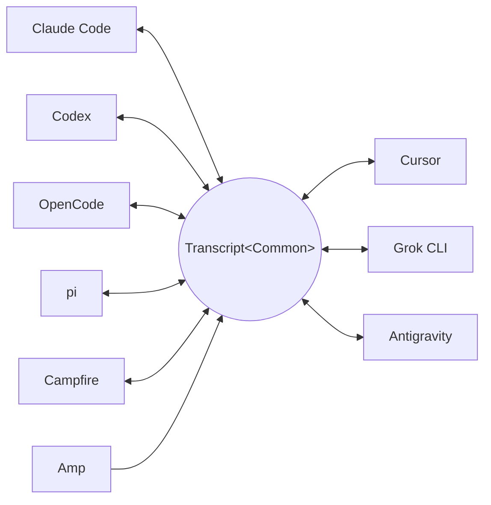

<p align="center">
  <picture>
    <source media="(prefers-color-scheme: dark)" srcset="docs/assets/wordmark-dark.svg">
    
  </picture>
</p>

<p align="center">txcript è una libreria per spostare sessioni tra agenti di coding</p>

<p align="center">
  <a href="README.md">English</a> | <a href="README.ja.md">日本語</a> | <a href="README.zh-CN.md">简体中文</a> | <a href="README.zh-TW.md">繁體中文</a> | <a href="README.ko.md">한국어</a> | <a href="README.de.md">Deutsch</a> | <a href="README.es.md">Español</a> | <a href="README.fr.md">Français</a> | Italiano | <a href="README.pt-BR.md">Português (Brasil)</a> | <a href="README.ru.md">Русский</a>
</p>

<p align="center">
  <a href="https://crates.io/crates/txcript"></a>
  <a href="https://www.npmjs.com/package/txcript"></a>
  <a href="https://docs.rs/txcript"></a>
  <a href="https://github.com/skillsynchq/txcript/actions/workflows/ci.yml"></a>
  <a href="LICENSE"></a>
</p>

<p align="center">
  <a href="https://claude.com/claude-code"></a>
  &nbsp;&nbsp;&nbsp;&nbsp;&nbsp;&nbsp;
  <a href="https://github.com/openai/codex"></a>
  &nbsp;&nbsp;&nbsp;&nbsp;&nbsp;&nbsp;
  <a href="https://opencode.ai"></a>
  &nbsp;&nbsp;&nbsp;&nbsp;&nbsp;&nbsp;
  <a href="https://pi.dev"></a>
  &nbsp;&nbsp;&nbsp;&nbsp;&nbsp;&nbsp;
  <a href="https://cursor.com"></a>
</p>

Inizia una sessione in Claude Code, raggiungi un limite di utilizzo o un punto
morto, e riprendila in Codex — con l'intera conversazione, il reasoning e la
cronologia degli strumenti intatti:

```console
$ txcript list
  claude_code   2h ago   fix relay reconnect bug          9f3a21…
  codex         1d ago   wire up usage accounting         c41b8d…
  opencode      3d ago   migrate store to sqlite          77e0f2…

$ txcript continue 9f3a21 --with codex    # re-synthesize into Codex, then launch it
```

txcript mappa il formato di trascrizione nativo di ogni harness attraverso un
modello comune tipizzato. Il caricamento/salvataggio nativo è lossless al
byte; la conversione tra harness preserva messaggi, reasoning, chiamate agli
strumenti, risultati degli strumenti, immagini, metadati e dati di utilizzo
ove disponibili. Viene distribuito come **libreria Rust**, **CLI** e
**modulo WASM** precompilato per Bun, Node e browser.

## In evidenza

- **9 harness, un solo modello** — ogni formato converte attraverso
  `Transcript<Common>`, quindi aggiungere un harness lo collega a tutti gli altri.
- **Round-trip lossless al byte** — caricare e salvare una sessione nel suo
  stesso formato la riproduce esattamente.
- **Continua ovunque** — `txcript continue <id> --with <harness>` riscrive una
  sessione nel formato nativo di un altro harness e lo lancia. L'originale
  non viene mai modificato.
- **Cerca in tutto** — ricerca fuzzy/per sottostringa su ogni sessione della
  macchina (sintassi in stile fzf, basata su [nucleo](https://github.com/helix-editor/nucleo)),
  come API di libreria, query CLI one-shot o picker interattivo.
- **Server MCP** — `txcript mcp` espone gli strumenti in sola lettura
  `list_sessions`, `search_sessions` e `read_session`, così gli agenti possono
  attingere alle sessioni passate come contesto.
- **Formati documentati** — il formato su disco di ogni harness è descritto in
  [`docs/formats/`](docs/formats), con la provenienza di ogni affermazione
  (documentazione ufficiale, permalink ai sorgenti o note di reverse engineering).

## Harness supportati

Ogni harness converte attraverso lo stesso modello canonico, quindi
aggiungerne uno lo collega a tutti gli altri:



Discovery, elenco, ricerca, `view` e round-trip nativi lossless al byte
funzionano per tutti e nove. Gli id stringa sono quelli accettati dalla CLI e
dalle API WASM.

| Harness | id | Sessioni su disco | Formato nativo | Conversione | Continua in | Doc |
|---|---|---|---|:---:|:---:|---|
| [Claude Code](https://claude.com/claude-code) | `claude_code` | `~/.claude/projects/` | JSONL | ⇄ | ✓ | [spec](docs/formats/claude-code.md) |
| [Codex](https://github.com/openai/codex) | `codex` | `~/.codex/sessions/` | JSONL di rollout | ⇄ | ✓ | [spec](docs/formats/codex.md) |
| [OpenCode](https://opencode.ai) | `opencode` | `~/.local/share/opencode/opencode.db` | SQLite | ⇄ | ✓ | [spec](docs/formats/opencode.md) |
| [pi](https://pi.dev) | `pi` | `~/.pi/agent/sessions/` | JSONL | ⇄ | ✓ | [spec](docs/formats/pi.md) |
| Campfire | `campfire` | `~/.campfire/agent/sessions/` | JSONL | ⇄ | ✓ | [spec](docs/formats/campfire.md) |
| [Cursor](https://cursor.com) | `cursor` | `~/.cursor/chats/` | SQLite (`store.db`) | ⇄ | ✓ | [spec](docs/formats/cursor.md) |
| [Grok CLI](https://github.com/xai-org/grok-build) | `grok` | `~/.grok/sessions/` | directory di sessione (JSON) | ⇄ | ✓ | [spec](docs/formats/grok.md) |
| [Amp](https://ampcode.com) | `amp` | `~/.local/share/amp/threads/` | JSON del thread | → | — <sup>1</sup> | [spec](docs/formats/amp.md) |
| [Antigravity](https://antigravity.google) | `antigravity` | `~/.gemini/antigravity-cli/` | SQLite (protobuf) | ⇄ | ✓ | [spec](docs/formats/antigravity.md) |

<sup>1</sup> I thread di Amp risiedono lato server e la CLI non ha
importazione: le sessioni convertono *da* Amp, ma non possono essere
continuate verso di esso.

## Installazione

**CLI** (installa il binario `txcript`):

```sh
cargo install --git https://github.com/skillsynchq/txcript txcript-cli
# or from a checkout: cargo install --path cli
```

**Libreria Rust**:

```sh
cargo add txcript
```

**JS / TS** (WASM precompilato, nessuna toolchain Rust necessaria):

```sh
bun add txcript     # or: npm install txcript
```

## CLI

Scopri le sessioni locali e continuane una in qualsiasi harness:

```sh
txcript list                             # local sessions across every harness
txcript continue <id>[#range]            # continue <id>, then launch its harness
    [--with <harness>]                    #   ...continuing in <harness> instead
    [--from <harness>]                    #   scope the id lookup to one harness
    [--out <dir>]                         #   write under <dir>; implies --no-resume
    [--no-resume]                         #   write the session but don't launch
txcript view <id>[#range]                # print a session as compact text
    [--from <harness>]                    #   scope the id lookup to one harness
```

`continue` cede il terminale all'harness al termine (su Unix esegue `exec`).
Le continuazioni nello stesso harness riprendono l'originale sul posto;
`--with` risintetizza prima la sessione nel formato nativo di un altro
harness. Una continuazione cross-harness lascia la sessione originale dov'era
— ciò che viene scritto è sempre una copia; la sorgente non viene mai
modificata né rimossa. Sovrascrivi il comando di lancio per harness con
`TRANSCRIPT_<HARNESS>_RESUME_CMD` (un template con `{id}`), ad es.
`TRANSCRIPT_CODEX_RESUME_CMD="codex resume {id}"`.

`view` stampa una proiezione testuale parsimoniosa in token con una riga
`── #N ──` che numera ogni messaggio. `#range` indica un intervallo di
messaggi 1-based e inclusivo — `abc#7` è il messaggio 7, `abc#5-12`, `abc#5-`
(dal 5 in poi), `abc#-10` (fino al 10) — e gli ordinali stampati sono quelli
usati dagli intervalli, quindi ciò che vedi è ciò che referenzi. `continue`
accetta lo stesso suffisso e continua solo quei messaggi come nuova sessione;
gli intervalli che separano una chiamata a uno strumento dal suo risultato
vengono rifiutati, suggerendo l'intervallo valido più vicino.

### Ricerca

```sh
txcript query 'relay bug'                # one-shot: ranked hits, highlighted
txcript query                            # fzf-style picker; Enter continues
    [--from <harness>]                   #   search only <harness> (default: all)
    [--with <harness>]                   #   continue the pick in <harness>
```

Il picker è privo di dipendenze (ANSI in raw mode): digita per filtrare con la
sintassi fuzzy in stile fzf, frecce / ctrl-p/n per spostarti, Invio per
continuare la selezione nel suo harness (o con `--with`), Esc per annullare.
Ogni riga mostra quale tipo di contenuto ha prodotto la corrispondenza —
testo utente, testo assistente, thinking, uso di strumenti, output di
strumenti o metadati di sessione.

### Server MCP

```sh
txcript mcp                              # stdio transport
```

Espone esattamente tre strumenti in sola lettura; i loro filtri opzionali
corrispondono a quelli della CLI:

- `list_sessions(from?, cwd?)`
- `search_sessions(pattern, from?, cwd?)`
- `read_session(id, from?)`

Omettendo `from` si includono tutti gli harness. Omettendo `cwd` non si
applica alcun filtro per directory, incluse le sessioni senza una working
directory registrata; quando `cwd` è presente, quelle sessioni non
corrispondono.

### Completamenti shell

```sh
txcript completion zsh > ~/.zfunc/_txcript      # or wherever your fpath looks
source <(txcript completion bash)               # bash, ad hoc
txcript completion fish > ~/.config/fish/completions/txcript.fish
```

## Libreria Rust

```toml
[dependencies]
txcript = "0.5"
# Drops the OpenCode SQLite store (rusqlite); the OpenCode codec stays available.
# txcript = { version = "0.5", default-features = false }
```

Tre livelli, dal più piccolo al più grande:

- `Codec` — `to_common` / `from_common` per ciascun harness; `convert::<A, B>`
  li concatena attraverso il modello canonico.
- `TextCodec` — `from_text` / `to_text`: analizza/renderizza il testo di
  sessione nativo di un harness, senza I/O.
- `Store` — scoperta/caricamento/salvataggio su un backend reale (directory di
  sessione, o DB SQLite per OpenCode e Cursor).

Converti in memoria (senza filesystem):

```rust
use txcript::harness::{claude_code, codex};
use txcript::{Codec, TextCodec, convert};

let claude = claude_code::ClaudeCode::from_text(jsonl_text)?;          // Transcript<ClaudeCode>
let codex = convert::<claude_code::ClaudeCode, codex::Codex>(&claude)?; // Transcript<Codex>
let codex_text = codex::Codex::to_text(&codex)?;                       // native rollout JSONL
```

Oppure passa dal disco con uno `Store`:

```rust
use txcript::harness::{claude_code, codex};
use txcript::{Store, convert};

let store = claude_code::ClaudeStore::default_root().expect("home dir");
let found = store.discover()?;                       // cheap metadata scan
let claude = store.load(&found[0].reference)?;       // Transcript<ClaudeCode>

let codex = convert::<_, codex::Codex>(&claude)?;
codex::CodexStore::default_root().expect("home dir").save(&codex)?;  // resumable on disk
```

Il modello canonico è `Transcript<Common>` — `Meta` + `Vec<Message>`, dove un
`Message` contiene `Block` tipizzati (`Text`, `Thinking`, `ToolUse`,
`ToolResult`, `Image`) e un enum `Tool` tipizzato.

Un comando slash eseguito dall'utente nell'harness è un `Tool::Command` in un
turno utente, con ciò che l'harness ha stampato in risposta come `ToolResult`
associato — così `/release patch` si legge come una chiamata anziché come il
markup in cui l'harness lo registra per caso. Lo `/` iniziale è ciò che lo
marca canonicamente: nessun nome di strumento rivolto al modello ne ha uno. Il
boilerplate che l'harness rigenera da solo (l'avvertenza local-command di
Claude Code) non sopravvive nel modello.

### Ricerca (feature `search`, attiva di default)

`txcript::search` supporta la ricerca fuzzy e per sottostringa sulle
trascrizioni tramite [nucleo](https://github.com/helix-editor/nucleo).
Ricerca one-shot:

```rust
use txcript::search::{Query, search};

let hits = search(&common, &Query::fuzzy("relay bug"));   // fzf syntax: 'exact ^prefix !not
for hit in hits {
    // hit.origin: User | Assistant | Thinking | ToolUse | ToolResult | Meta
    // hit.span addresses the message; hit.highlights are char ranges into hit.line
    let messages = common.fragment(&hit.span);            // zero-copy: Option<&[Message]>
}
```

Per una ricerca in stile picker, costruisci un `Index` una volta sola e
interrogalo a ogni pressione di tasto:

```rust
use txcript::search::{DocKey, Index, Query};

let mut index = Index::new();
index.insert(DocKey { harness, id }, &common);   // re-insert replaces; caller owns refresh
let matches = index.query(&Query::fuzzy("srch")); // ranked docs, best lines as hits
```

Un pattern vuoto restituisce i documenti dal più recente al più vecchio. Gli
output degli strumenti sono esclusi di default; usa `Origin::ALL` per
includerli. `Query.harnesses`, `Query.limit` e `Query.hits_per_doc`
restringono i risultati.

### Proiezione testuale

`txcript::text::to_text(&common)` è una proiezione unidirezionale e
parsimoniosa in token di `Transcript<Common>` da usare come contesto per LLM.
Mantiene i messaggi, il testo di reasoning e chiamate/risultati compatti degli
strumenti, omettendo i payload utili solo al replay come il reasoning
cifrato, la contabilità dell'utilizzo e i byte delle immagini inline.
`to_text_fragment(&common, &span)` renderizza uno `Span` del corpo nello
stesso formato, con righe `── #N ──` che riportano l'ordinale 1-based di ogni
messaggio nella sessione completa — la numerazione che `txcript view` stampa.

## Modulo WASM (Bun / Node / browser)

Il codec puro compila in WebAssembly; l'host JS possiede tutto l'I/O e invoca
il modulo per la trasformazione. Il livello `Store` (filesystem, SQLite,
sottoprocessi) resta nativo ed è escluso dalla build WASM. Il pacchetto npm
include il wasm precompilato:

```sh
bun add txcript     # or: npm install txcript
```

```ts
import { convert, toCommon, fromCommon, harnesses } from "txcript";
import { readFileSync, writeFileSync } from "node:fs";

const input = readFileSync("rollout.jsonl", "utf8");

// native -> native (e.g. a Codex rollout into Claude Code's JSONL)
writeFileSync("session.jsonl", convert(input, "codex", "claude_code"));

// canonical view, and back
const common = JSON.parse(toCommon(input, "codex"));   // { meta, messages }
const pi = fromCommon(JSON.stringify(common), "pi");

harnesses(); // ["claude_code","codex","opencode","pi","campfire","cursor","grok","amp","antigravity"]
```

Testo in ingresso / testo in uscita: `input` è il testo di sessione nativo di
un harness (JSONL per claude_code/codex/pi/campfire, il JSON di
`opencode export` per opencode, un export JSON dello `store.db` di Cursor per
cursor, un bundle JSON dei file della directory di sessione per grok, il
documento JSON del thread — la forma di `amp threads export` — per amp, e un
dump JSON del database delle conversazioni — blob di step protobuf codificati
in esadecimale — per antigravity); il risultato è il testo nativo del formato
di destinazione. Nomi di harness non validi o input non analizzabile sollevano
un `Error` JS.

Per compilare invece il wasm dai sorgenti:

```sh
git clone https://github.com/skillsynchq/txcript.git
cd txcript
bun run setup        # once: wasm target + wasm-bindgen-cli
bun run build        # produces ./pkg
```

## Documentazione dei formati

Non tutti questi formati di trascrizione sono documentati dai rispettivi
vendor. [`docs/formats/`](docs/formats) contiene un documento per harness —
dove vivono le sessioni su disco, come la discovery le trova, una dissezione
di ogni parte del formato e le sue stranezze — ciascuno etichettato con la
provenienza di ciò che afferma: documentazione ufficiale, il codice di
serializzazione open source dell'harness stesso (citato con permalink
ancorati al commit) o reverse engineering.

## Sviluppo

```sh
cargo test                                          # native suite
cargo test --no-default-features                    # without the SQLite store
bun run build && bun examples/convert.ts <file> <from> <to>
```

Il binario vive in un crate workspace dedicato (`cli/`, pacchetto
`txcript-cli`), così le sue dipendenze (clap) non toccano mai i consumatori
della libreria.

## Licenza

[Apache-2.0](LICENSE)
