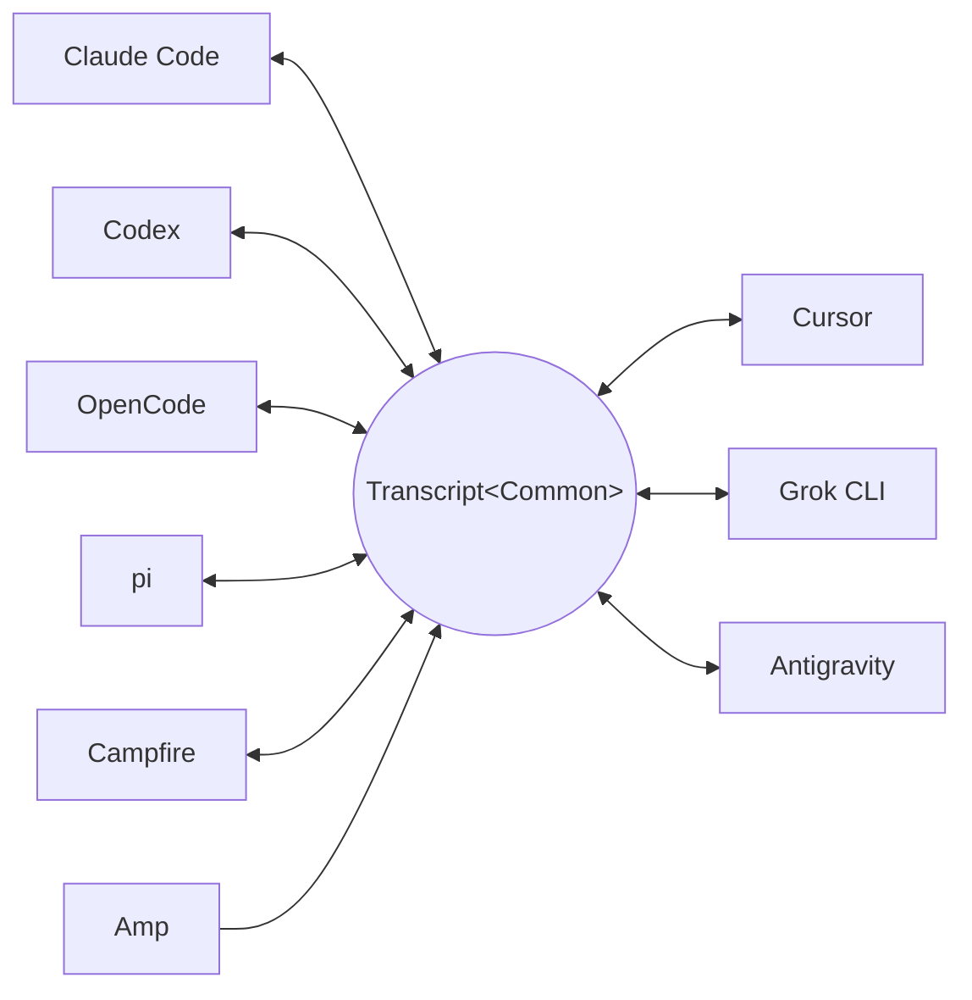

<p align="center">
  <picture>
    <source media="(prefers-color-scheme: dark)" srcset="docs/assets/wordmark-dark.svg">
    
  </picture>
</p>

<p align="center">コーディングエージェントのセッショントランスクリプトをハーネス形式間で変換 — そして任意のセッションを任意のハーネスで続行。</p>

<p align="center">
  <a href="README.md">English</a> | 日本語 | <a href="README.zh-CN.md">简体中文</a> | <a href="README.zh-TW.md">繁體中文</a> | <a href="README.ko.md">한국어</a> | <a href="README.de.md">Deutsch</a> | <a href="README.es.md">Español</a> | <a href="README.fr.md">Français</a> | <a href="README.it.md">Italiano</a> | <a href="README.pt-BR.md">Português (Brasil)</a> | <a href="README.ru.md">Русский</a>
</p>

<p align="center">
  <a href="https://crates.io/crates/txcript"></a>
  <a href="https://www.npmjs.com/package/txcript"></a>
  <a href="https://docs.rs/txcript"></a>
  <a href="https://github.com/skillsynchq/txcript/actions/workflows/ci.yml"></a>
  <a href="LICENSE"></a>
</p>

<p align="center">
  <a href="https://claude.com/claude-code"></a>
  &nbsp;&nbsp;&nbsp;&nbsp;&nbsp;&nbsp;
  <a href="https://github.com/openai/codex"></a>
  &nbsp;&nbsp;&nbsp;&nbsp;&nbsp;&nbsp;
  <a href="https://opencode.ai"></a>
  &nbsp;&nbsp;&nbsp;&nbsp;&nbsp;&nbsp;
  <a href="https://pi.dev"></a>
  &nbsp;&nbsp;&nbsp;&nbsp;&nbsp;&nbsp;
  <a href="https://cursor.com"></a>
</p>

Claude Code でセッションを始め、使用量制限や行き詰まりに突き当たったら、Codex で
そのまま続きから — 会話、推論、ツール履歴をすべて保ったまま:

```console
$ txcript list
  claude_code   2h ago   fix relay reconnect bug          9f3a21…
  codex         1d ago   wire up usage accounting         c41b8d…
  opencode      3d ago   migrate store to sqlite          77e0f2…

$ txcript continue 9f3a21 --with codex    # re-synthesize into Codex, then launch it
```

txcript は各ハーネスのネイティブなトランスクリプト形式を、型付きの共通モデルを
介してマッピングします。ネイティブ形式のロード/セーブはバイト単位で無損失であり、
ハーネス間の変換ではメッセージ、推論、ツール呼び出し、ツール結果、画像、
メタデータ、使用量情報を（利用可能な範囲で）保持します。**Rust ライブラリ**、
**CLI**、そして Bun・Node・ブラウザ向けのビルド済み **WASM モジュール**として
提供されます。

## ハイライト

- **9 つのハーネス、1 つのモデル** — すべての形式は `Transcript<Common>` を介して
  変換されるため、ハーネスを 1 つ追加すれば他のすべてとつながります。
- **バイト無損失のラウンドトリップ** — セッションを自身の形式でロードして保存
  すると、元と完全に一致するものが再現されます。
- **どこでも続行** — `txcript continue <id> --with <harness>` はセッションを別の
  ハーネスのネイティブ形式に書き直して起動します。元のセッションが変更される
  ことはありません。
- **すべてを検索** — マシン上のすべてのセッションを対象にしたファジー/部分文字列
  検索（fzf 流の構文、[nucleo](https://github.com/helix-editor/nucleo) を採用）。
  ライブラリ API、ワンショットの CLI クエリ、対話型ピッカーのいずれでも
  利用できます。
- **MCP サーバー** — `txcript mcp` は読み取り専用の `list_sessions`、
  `search_sessions`、`read_session` ツールを公開し、エージェントが過去の
  セッションをコンテキストとして掘り起こせるようにします。
- **文書化されたフォーマット** — 各ハーネスのオンディスク形式は
  [`docs/formats/`](docs/formats) にまとめられており、各記述には出典（公式
  ドキュメント、ソースへのパーマリンク、またはリバースエンジニアリングのメモ）が
  付記されています。

## 対応ハーネス

すべてのハーネスは同じ正準モデルを介して変換されるため、ハーネスを 1 つ追加
すれば他のすべてとつながります:



ディスカバリ、一覧表示、検索、`view`、そしてバイト無損失のネイティブな
ラウンドトリップは、9 つすべてのハーネスで動作します。この文字列 id が、
CLI と WASM API に渡す値です。

| ハーネス | id | ディスク上のセッション | ネイティブ形式 | 変換 | 続行先 | ドキュメント |
|---|---|---|:---:|:---:|---|
| [Claude Code](https://claude.com/claude-code) | `claude_code` | `~/.claude/projects/` | JSONL | ⇄ | ✓ | [仕様](docs/formats/claude-code.md) |
| [Codex](https://github.com/openai/codex) | `codex` | `~/.codex/sessions/` | ロールアウト JSONL | ⇄ | ✓ | [仕様](docs/formats/codex.md) |
| [OpenCode](https://opencode.ai) | `opencode` | `~/.local/share/opencode/opencode.db` | SQLite | ⇄ | ✓ | [仕様](docs/formats/opencode.md) |
| [pi](https://pi.dev) | `pi` | `~/.pi/agent/sessions/` | JSONL | ⇄ | ✓ | [仕様](docs/formats/pi.md) |
| Campfire | `campfire` | `~/.campfire/agent/sessions/` | JSONL | ⇄ | ✓ | [仕様](docs/formats/campfire.md) |
| [Cursor](https://cursor.com) | `cursor` | `~/.cursor/chats/` | SQLite（`store.db`） | ⇄ | ✓ | [仕様](docs/formats/cursor.md) |
| [Grok CLI](https://github.com/xai-org/grok-build) | `grok` | `~/.grok/sessions/` | セッションディレクトリ（JSON） | ⇄ | ✓ | [仕様](docs/formats/grok.md) |
| [Amp](https://ampcode.com) | `amp` | `~/.local/share/amp/threads/` | スレッド JSON | → | — <sup>1</sup> | [仕様](docs/formats/amp.md) |
| [Antigravity](https://antigravity.google) | `antigravity` | `~/.gemini/antigravity-cli/` | SQLite（protobuf） | ⇄ | ✓ | [仕様](docs/formats/antigravity.md) |

<sup>1</sup> Amp のスレッドはサーバー側にあり、CLI にはインポート機能が
ありません: セッションは Amp *から*変換できますが、Amp へ続行することは
できません。

## インストール

**CLI**（`txcript` バイナリをインストール）:

```sh
cargo install --git https://github.com/skillsynchq/txcript txcript-cli
# or from a checkout: cargo install --path cli
```

**Rust ライブラリ**:

```sh
cargo add txcript
```

**JS / TS**（ビルド済み WASM、Rust ツールチェーン不要）:

```sh
bun add txcript     # or: npm install txcript
```

## CLI

ローカルのセッションを見つけて、任意のハーネスで続行します:

```sh
txcript list                             # local sessions across every harness
txcript continue <id>[#range]            # continue <id>, then launch its harness
    [--with <harness>]                    #   ...continuing in <harness> instead
    [--from <harness>]                    #   scope the id lookup to one harness
    [--out <dir>]                         #   write under <dir>; implies --no-resume
    [--no-resume]                         #   write the session but don't launch
txcript view <id>[#range]                # print a session as compact text
    [--from <harness>]                    #   scope the id lookup to one harness
```

`continue` は完了時にターミナルをハーネスに引き渡します（Unix では `exec`
します）。同一ハーネスでの続行は元のセッションをその場で再開し、`--with` を
指定するとまず別ハーネスのネイティブ形式に再合成します。ハーネスをまたぐ続行
では元のセッションはそのままの場所に残ります — 書き出されるのは常にコピーで
あり、ソースが変更・削除されることはありません。起動コマンドはハーネスごとに
`TRANSCRIPT_<HARNESS>_RESUME_CMD`（`{id}` テンプレート）で上書きできます。例:
`TRANSCRIPT_CODEX_RESUME_CMD="codex resume {id}"`。

`view` は、各メッセージに番号を振る `── #N ──` の区切り線付きで、トークン量を
意識したテキスト射影を出力します。`#range` は 1 始まり・両端含みのメッセージ
範囲を指定します — `abc#7` はメッセージ 7、`abc#5-12`、`abc#5-`（5 以降）、
`abc#-10`（10 まで）— そして出力に表示される序数がそのまま範囲指定に使う番号
なので、見えているものをそのまま参照できます。`continue` も同じサフィックスを
受け付け、その範囲のメッセージだけを新しいセッションとして続行します。ツール
呼び出しをその結果から切り離してしまう範囲は拒否され、最も近い有効な範囲が
提案されます。

### 検索

```sh
txcript query 'relay bug'                # one-shot: ranked hits, highlighted
txcript query                            # fzf-style picker; Enter continues
    [--from <harness>]                   #   search only <harness> (default: all)
    [--with <harness>]                   #   continue the pick in <harness>
```

ピッカーは依存関係なし（raw モードの ANSI）で動作します。文字を入力すると
fzf 流のファジー構文でフィルタされ、矢印キーまたは ctrl-p/n で移動、Enter で
選択したセッションを元のハーネス（または `--with` で指定したハーネス）で続行、
Esc でキャンセルします。各行には、どの種類のコンテンツがマッチしたか — ユーザー
テキスト、アシスタントテキスト、思考、ツール使用、ツール出力、セッション
メタデータ — が表示されます。

### MCP サーバー

```sh
txcript mcp                              # stdio transport
```

読み取り専用ツールをちょうど 3 つ公開します。オプションのフィルタは CLI と
同じです:

- `list_sessions(from?, cwd?)`
- `search_sessions(pattern, from?, cwd?)`
- `read_session(id, from?)`

`from` を省略するとすべてのハーネスが対象になります。`cwd` を省略すると
ディレクトリによるフィルタは行われず、作業ディレクトリが記録されていない
セッションも含まれます。`cwd` を指定した場合、そうしたセッションはマッチ
しません。

### シェル補完

```sh
txcript completion zsh > ~/.zfunc/_txcript      # or wherever your fpath looks
source <(txcript completion bash)               # bash, ad hoc
txcript completion fish > ~/.config/fish/completions/txcript.fish
```

## Rust ライブラリ

```toml
[dependencies]
txcript = "0.5"
# Drops the OpenCode SQLite store (rusqlite); the OpenCode codec stays available.
# txcript = { version = "0.5", default-features = false }
```

小さい順に 3 つのレイヤーがあります:

- `Codec` — ハーネスごとの `to_common` / `from_common`。`convert::<A, B>` は
  それらを正準モデル経由で連結します。
- `TextCodec` — `from_text` / `to_text`: ハーネスのネイティブなセッション
  テキストをパース/レンダリングします。I/O はありません。
- `Store` — 実際のバックエンド（セッションディレクトリ、または OpenCode と
  Cursor の SQLite DB）に対して発見/ロード/保存を行います。

メモリ内で変換する場合（ファイルシステム不要）:

```rust
use txcript::harness::{claude_code, codex};
use txcript::{Codec, TextCodec, convert};

let claude = claude_code::ClaudeCode::from_text(jsonl_text)?;          // Transcript<ClaudeCode>
let codex = convert::<claude_code::ClaudeCode, codex::Codex>(&claude)?; // Transcript<Codex>
let codex_text = codex::Codex::to_text(&codex)?;                       // native rollout JSONL
```

または `Store` でディスクを経由する場合:

```rust
use txcript::harness::{claude_code, codex};
use txcript::{Store, convert};

let store = claude_code::ClaudeStore::default_root().expect("home dir");
let found = store.discover()?;                       // cheap metadata scan
let claude = store.load(&found[0].reference)?;       // Transcript<ClaudeCode>

let codex = convert::<_, codex::Codex>(&claude)?;
codex::CodexStore::default_root().expect("home dir").save(&codex)?;  // resumable on disk
```

正準モデルは `Transcript<Common>` — `Meta` + `Vec<Message>` で、`Message` は
型付きの `Block`（`Text`、`Thinking`、`ToolUse`、`ToolResult`、`Image`）と
型付きの `Tool` enum を保持します。

ユーザーがハーネス上で実行したスラッシュコマンドは、ユーザーターン上の
`Tool::Command` として表現され、ハーネスが出力として返したものが対になる
`ToolResult` になります — つまり `/release patch` は、ハーネスがたまたま記録に
使うマークアップとしてではなく、呼び出しとして読めます。正準的な目印は先頭の
`/` です。モデルに公開されるツール名に `/` で始まるものはありません。ハーネスが
自前で再生成するボイラープレート（Claude Code の local-command に関する注記
など）はモデルには残りません。

### 検索（`search` フィーチャー、デフォルトで有効）

`txcript::search` は [nucleo](https://github.com/helix-editor/nucleo) を用いた、
トランスクリプトに対するファジー検索と部分文字列検索をサポートします。
ワンショット検索:

```rust
use txcript::search::{Query, search};

let hits = search(&common, &Query::fuzzy("relay bug"));   // fzf syntax: 'exact ^prefix !not
for hit in hits {
    // hit.origin: User | Assistant | Thinking | ToolUse | ToolResult | Meta
    // hit.span addresses the message; hit.highlights are char ranges into hit.line
    let messages = common.fragment(&hit.span);            // zero-copy: Option<&[Message]>
}
```

ピッカー型の検索では、`Index` を一度構築してキーストロークごとにクエリします:

```rust
use txcript::search::{DocKey, Index, Query};

let mut index = Index::new();
index.insert(DocKey { harness, id }, &common);   // re-insert replaces; caller owns refresh
let matches = index.query(&Query::fuzzy("srch")); // ranked docs, best lines as hits
```

空のパターンはドキュメントを新しい順に返します。ツール出力はデフォルトで除外
されます。含めるには `Origin::ALL` を使います。`Query.harnesses`、`Query.limit`、
`Query.hits_per_doc` で結果を絞り込めます。

### テキスト射影

`txcript::text::to_text(&common)` は、LLM のコンテキストとして使うための、
`Transcript<Common>` の一方向でトークン量を意識した射影です。メッセージ、推論
テキスト、コンパクトなツール呼び出し/結果を保持しつつ、暗号化された推論、
使用量の計上、インライン画像バイトといった再生専用のペイロードは省きます。
`to_text_fragment(&common, &span)` は本文の `Span` を同じ形式でレンダリングし、
`── #N ──` の区切り線には、セッション全体における各メッセージの 1 始まりの
序数 — `txcript view` が表示するのと同じ番号 — が付きます。

## WASM モジュール（Bun / Node / ブラウザ）

純粋なコーデック部分は WebAssembly にコンパイルされます。I/O はすべて JS ホスト
側が担い、変換処理だけを呼び出します。`Store` レイヤー（ファイルシステム、
SQLite、サブプロセス）はネイティブのままで、WASM ビルドには含まれません。
npm パッケージにはビルド済みの wasm が同梱されています:

```sh
bun add txcript     # or: npm install txcript
```

```ts
import { convert, toCommon, fromCommon, harnesses } from "txcript";
import { readFileSync, writeFileSync } from "node:fs";

const input = readFileSync("rollout.jsonl", "utf8");

// native -> native (e.g. a Codex rollout into Claude Code's JSONL)
writeFileSync("session.jsonl", convert(input, "codex", "claude_code"));

// canonical view, and back
const common = JSON.parse(toCommon(input, "codex"));   // { meta, messages }
const pi = fromCommon(JSON.stringify(common), "pi");

harnesses(); // ["claude_code","codex","opencode","pi","campfire","cursor","grok","amp","antigravity"]
```

テキスト入力・テキスト出力: `input` はハーネスのネイティブなセッションテキスト
です（claude_code/codex/pi/campfire は JSONL、opencode は `opencode export` の
JSON、cursor は Cursor の `store.db` の JSON エクスポート、grok はセッション
ディレクトリ内ファイルの JSON バンドル、amp はスレッドの JSON ドキュメント —
`amp threads export` の形式 —、antigravity は会話データベースの JSON ダンプ —
16 進エンコードされた protobuf ステップ blob）。結果はターゲットのネイティブ
テキストです。不正なハーネス名やパースできない入力は JS の `Error` を投げます。

代わりにソースから wasm をビルドする場合:

```sh
git clone https://github.com/skillsynchq/txcript.git
cd txcript
bun run setup        # once: wasm target + wasm-bindgen-cli
bun run build        # produces ./pkg
```

## フォーマットドキュメント

これらのトランスクリプト形式のすべてがベンダーによって文書化されているわけでは
ありません。[`docs/formats/`](docs/formats) にはハーネスごとに 1 つのドキュメント
があります — セッションがディスク上のどこにあるか、ディスカバリがそれをどう
見つけるか、フォーマットの各部分の解剖、そしてその癖 — そして各記述には出典が
タグ付けされています: 公式ドキュメント、ハーネス自身のオープンソースの
シリアライズコード（コミット固定のパーマリンク付きで引用）、またはリバース
エンジニアリングです。

## 開発

```sh
cargo test                                          # native suite
cargo test --no-default-features                    # without the SQLite store
bun run build && bun examples/convert.ts <file> <from> <to>
```

バイナリは独立したワークスペースクレート（`cli/`、パッケージ `txcript-cli`）に
置かれているため、その依存関係（clap）がライブラリ利用者に影響することは
ありません。

## ライセンス

[Apache-2.0](LICENSE)
