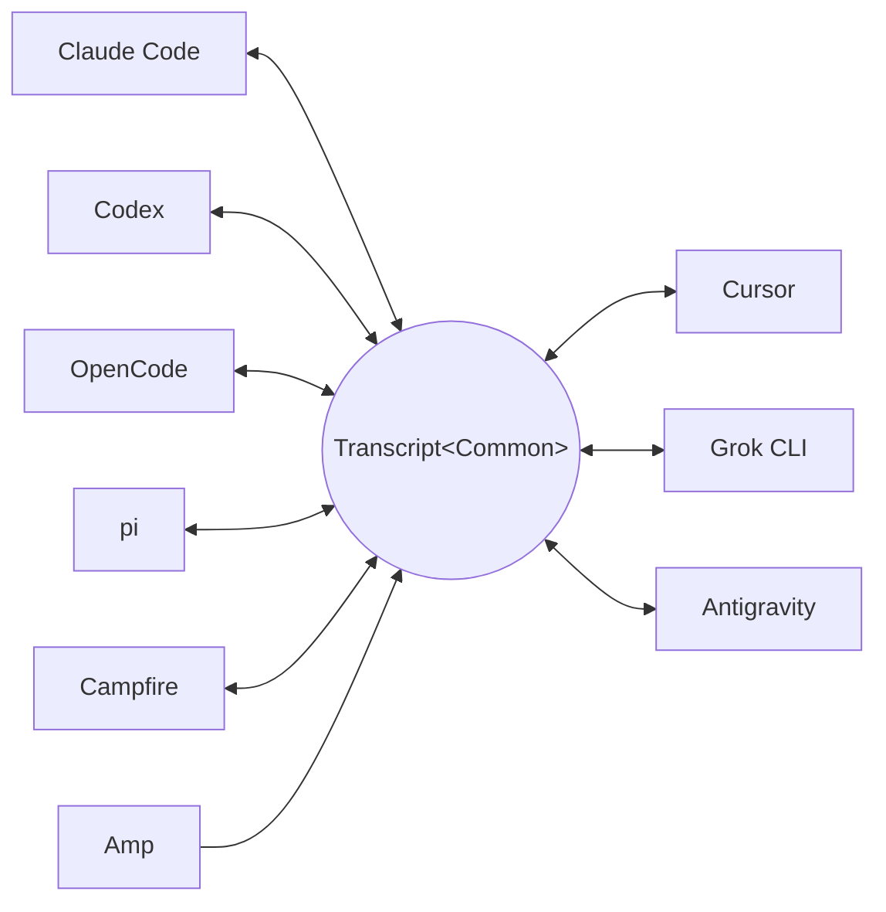

<p align="center">
  <picture>
    <source media="(prefers-color-scheme: dark)" srcset="docs/assets/wordmark-dark.svg">
    
  </picture>
</p>

<p align="center">txcript é uma biblioteca para mover sessões entre agentes de codificação</p>

<p align="center">
  <a href="README.md">English</a> | <a href="README.ja.md">日本語</a> | <a href="README.zh-CN.md">简体中文</a> | <a href="README.zh-TW.md">繁體中文</a> | <a href="README.ko.md">한국어</a> | <a href="README.de.md">Deutsch</a> | <a href="README.es.md">Español</a> | <a href="README.fr.md">Français</a> | <a href="README.it.md">Italiano</a> | Português (Brasil) | <a href="README.ru.md">Русский</a>
</p>

<p align="center">
  <a href="https://crates.io/crates/txcript"></a>
  <a href="https://www.npmjs.com/package/txcript"></a>
  <a href="https://docs.rs/txcript"></a>
  <a href="https://github.com/skillsynchq/txcript/actions/workflows/ci.yml"></a>
  <a href="LICENSE"></a>
</p>

<p align="center">
  <a href="https://claude.com/claude-code"></a>
  &nbsp;&nbsp;&nbsp;&nbsp;&nbsp;&nbsp;
  <a href="https://github.com/openai/codex"></a>
  &nbsp;&nbsp;&nbsp;&nbsp;&nbsp;&nbsp;
  <a href="https://opencode.ai"></a>
  &nbsp;&nbsp;&nbsp;&nbsp;&nbsp;&nbsp;
  <a href="https://pi.dev"></a>
  &nbsp;&nbsp;&nbsp;&nbsp;&nbsp;&nbsp;
  <a href="https://cursor.com"></a>
</p>

Comece uma sessão no Claude Code, atinja um limite de uso ou um beco sem
saída, e retome-a no Codex — com toda a conversa, o raciocínio e o histórico
de ferramentas intactos:

```console
$ txcript list
  claude_code   2h ago   fix relay reconnect bug          9f3a21…
  codex         1d ago   wire up usage accounting         c41b8d…
  opencode      3d ago   migrate store to sqlite          77e0f2…

$ txcript continue 9f3a21 --with codex    # re-synthesize into Codex, then launch it
```

O txcript mapeia o formato de transcrição nativo de cada harness por meio de
um modelo comum tipado. Carregar/salvar no formato nativo é lossless byte a
byte; a conversão entre harnesses preserva mensagens, raciocínio, chamadas de
ferramentas, resultados de ferramentas, imagens, metadados e dados de uso,
quando disponíveis. É distribuído como **biblioteca Rust**, **CLI** e
**módulo WASM** pré-compilado para Bun, Node e navegadores.

## Destaques

- **9 harnesses, um único modelo** — todo formato é convertido por meio de
  `Transcript<Common>`, então adicionar um harness o conecta a todos os outros.
- **Round-trips lossless byte a byte** — carregar e salvar uma sessão em seu
  próprio formato a reproduz exatamente.
- **Continue em qualquer lugar** — `txcript continue <id> --with <harness>`
  reescreve uma sessão no formato nativo de outro harness e o inicia. O
  original nunca é modificado.
- **Pesquise tudo** — busca fuzzy/por substring em todas as sessões da
  máquina (sintaxe no estilo fzf, com [nucleo](https://github.com/helix-editor/nucleo)
  por baixo), como API de biblioteca, consulta única na CLI ou seletor
  interativo.
- **Servidor MCP** — `txcript mcp` expõe as ferramentas somente leitura
  `list_sessions`, `search_sessions` e `read_session`, para que agentes
  possam explorar sessões passadas como contexto.
- **Formatos documentados** — o formato em disco de cada harness está
  descrito em [`docs/formats/`](docs/formats), com a proveniência de cada
  afirmação (documentação oficial, permalinks para o código-fonte ou notas de
  engenharia reversa).

## Harnesses suportados

Todo harness converte através do mesmo modelo canônico, então adicionar um o
conecta a todos os outros:



Descoberta, listagem, pesquisa, `view` e round-trips nativos lossless byte a
byte funcionam para todos os nove. Os ids em string são o que a CLI e as APIs
WASM aceitam.

| Harness | id | Sessões em disco | Formato nativo | Conversão | Continuar para | Doc |
|---|---|---|---|:---:|:---:|---|
| [Claude Code](https://claude.com/claude-code) | `claude_code` | `~/.claude/projects/` | JSONL | ⇄ | ✓ | [spec](docs/formats/claude-code.md) |
| [Codex](https://github.com/openai/codex) | `codex` | `~/.codex/sessions/` | JSONL de rollout | ⇄ | ✓ | [spec](docs/formats/codex.md) |
| [OpenCode](https://opencode.ai) | `opencode` | `~/.local/share/opencode/opencode.db` | SQLite | ⇄ | ✓ | [spec](docs/formats/opencode.md) |
| [pi](https://pi.dev) | `pi` | `~/.pi/agent/sessions/` | JSONL | ⇄ | ✓ | [spec](docs/formats/pi.md) |
| Campfire | `campfire` | `~/.campfire/agent/sessions/` | JSONL | ⇄ | ✓ | [spec](docs/formats/campfire.md) |
| [Cursor](https://cursor.com) | `cursor` | `~/.cursor/chats/` | SQLite (`store.db`) | ⇄ | ✓ | [spec](docs/formats/cursor.md) |
| [Grok CLI](https://github.com/xai-org/grok-build) | `grok` | `~/.grok/sessions/` | diretório de sessão (JSON) | ⇄ | ✓ | [spec](docs/formats/grok.md) |
| [Amp](https://ampcode.com) | `amp` | `~/.local/share/amp/threads/` | JSON da thread | → | — <sup>1</sup> | [spec](docs/formats/amp.md) |
| [Antigravity](https://antigravity.google) | `antigravity` | `~/.gemini/antigravity-cli/` | SQLite (protobuf) | ⇄ | ✓ | [spec](docs/formats/antigravity.md) |

<sup>1</sup> As threads do Amp ficam no servidor e a CLI não tem importação:
as sessões convertem *a partir do* Amp, mas não podem ser continuadas para
ele.

## Instalação

**CLI** (instala o binário `txcript`):

```sh
cargo install --git https://github.com/skillsynchq/txcript txcript-cli
# or from a checkout: cargo install --path cli
```

**Biblioteca Rust**:

```sh
cargo add txcript
```

**JS / TS** (WASM pré-compilado, sem necessidade de toolchain Rust):

```sh
bun add txcript     # or: npm install txcript
```

## CLI

Descubra sessões locais e continue uma delas em qualquer harness:

```sh
txcript list                             # local sessions across every harness
txcript continue <id>[#range]            # continue <id>, then launch its harness
    [--with <harness>]                    #   ...continuing in <harness> instead
    [--from <harness>]                    #   scope the id lookup to one harness
    [--out <dir>]                         #   write under <dir>; implies --no-resume
    [--no-resume]                         #   write the session but don't launch
txcript view <id>[#range]                # print a session as compact text
    [--from <harness>]                    #   scope the id lookup to one harness
```

`continue` entrega o terminal ao harness ao terminar (no Unix, faz `exec`).
Continuações no mesmo harness retomam o original no próprio lugar; `--with`
primeiro ressintetiza a sessão no formato nativo de outro harness. Uma
continuação entre harnesses deixa a sessão original onde estava — o que é
gravado é sempre uma cópia; a origem nunca é modificada nem removida.
Sobrescreva o comando de inicialização por harness com
`TRANSCRIPT_<HARNESS>_RESUME_CMD` (um template com `{id}`), por exemplo
`TRANSCRIPT_CODEX_RESUME_CMD="codex resume {id}"`.

`view` imprime uma projeção de texto econômica em tokens, com uma régua
`── #N ──` numerando cada mensagem. `#range` indica um intervalo de mensagens
inclusivo e baseado em 1 — `abc#7` é a mensagem 7, `abc#5-12`, `abc#5-` (da 5
em diante), `abc#-10` (até a 10) — e os ordinais impressos são os que os
intervalos usam, então o que você vê é o que você referencia. `continue`
aceita o mesmo sufixo e continua apenas essas mensagens como uma nova sessão;
intervalos que separam uma chamada de ferramenta do seu resultado são
recusados, com a sugestão do intervalo válido mais próximo.

### Pesquisa

```sh
txcript query 'relay bug'                # one-shot: ranked hits, highlighted
txcript query                            # fzf-style picker; Enter continues
    [--from <harness>]                   #   search only <harness> (default: all)
    [--with <harness>]                   #   continue the pick in <harness>
```

O seletor não tem dependências (ANSI em raw mode): digite para filtrar com a
sintaxe fuzzy no estilo fzf, setas / ctrl-p/n para navegar, Enter para
continuar a seleção no seu próprio harness (ou com `--with`), Esc para
cancelar. Cada linha mostra que tipo de conteúdo teve correspondência —
texto do usuário, texto do assistente, thinking, uso de ferramenta, saída de
ferramenta ou metadados da sessão.

### Servidor MCP

```sh
txcript mcp                              # stdio transport
```

Expõe exatamente três ferramentas somente leitura; seus filtros opcionais
correspondem aos da CLI:

- `list_sessions(from?, cwd?)`
- `search_sessions(pattern, from?, cwd?)`
- `read_session(id, from?)`

Omitir `from` inclui todos os harnesses. Omitir `cwd` não aplica nenhum
filtro de diretório, incluindo as sessões sem um diretório de trabalho
registrado; quando `cwd` está presente, essas sessões não correspondem.

### Completions de shell

```sh
txcript completion zsh > ~/.zfunc/_txcript      # or wherever your fpath looks
source <(txcript completion bash)               # bash, ad hoc
txcript completion fish > ~/.config/fish/completions/txcript.fish
```

## Biblioteca Rust

```toml
[dependencies]
txcript = "0.5"
# Drops the OpenCode SQLite store (rusqlite); the OpenCode codec stays available.
# txcript = { version = "0.5", default-features = false }
```

Três camadas, da menor para a maior:

- `Codec` — `to_common` / `from_common` por harness; `convert::<A, B>` os
  encadeia através do modelo canônico.
- `TextCodec` — `from_text` / `to_text`: faz parse/renderiza o texto de
  sessão nativo de um harness, sem I/O.
- `Store` — descoberta/carregamento/salvamento em um backend real (diretórios
  de sessão, ou bancos SQLite para OpenCode e Cursor).

Converta em memória (sem sistema de arquivos):

```rust
use txcript::harness::{claude_code, codex};
use txcript::{Codec, TextCodec, convert};

let claude = claude_code::ClaudeCode::from_text(jsonl_text)?;          // Transcript<ClaudeCode>
let codex = convert::<claude_code::ClaudeCode, codex::Codex>(&claude)?; // Transcript<Codex>
let codex_text = codex::Codex::to_text(&codex)?;                       // native rollout JSONL
```

Ou passe pelo disco com um `Store`:

```rust
use txcript::harness::{claude_code, codex};
use txcript::{Store, convert};

let store = claude_code::ClaudeStore::default_root().expect("home dir");
let found = store.discover()?;                       // cheap metadata scan
let claude = store.load(&found[0].reference)?;       // Transcript<ClaudeCode>

let codex = convert::<_, codex::Codex>(&claude)?;
codex::CodexStore::default_root().expect("home dir").save(&codex)?;  // resumable on disk
```

O modelo canônico é `Transcript<Common>` — `Meta` + `Vec<Message>`, em que
uma `Message` contém `Block`s tipados (`Text`, `Thinking`, `ToolUse`,
`ToolResult`, `Image`) e um enum `Tool` tipado.

Um comando de barra que o usuário executou no harness é um `Tool::Command` em
um turno do usuário, com o que o harness imprimiu de volta como o
`ToolResult` correspondente — assim, `/release patch` é lido como uma
chamada, e não como a marcação em que o harness por acaso o registra. A `/`
inicial é o que o marca canonicamente: nenhum nome de ferramenta voltado ao
modelo tem uma. O boilerplate que o harness regenera por conta própria (a
ressalva de local-command do Claude Code) não sobrevive no modelo.

### Pesquisa (feature `search`, ativada por padrão)

`txcript::search` oferece busca fuzzy e por substring nas transcrições via
[nucleo](https://github.com/helix-editor/nucleo). Busca única:

```rust
use txcript::search::{Query, search};

let hits = search(&common, &Query::fuzzy("relay bug"));   // fzf syntax: 'exact ^prefix !not
for hit in hits {
    // hit.origin: User | Assistant | Thinking | ToolUse | ToolResult | Meta
    // hit.span addresses the message; hit.highlights are char ranges into hit.line
    let messages = common.fragment(&hit.span);            // zero-copy: Option<&[Message]>
}
```

Para busca no estilo seletor, construa um `Index` uma vez e consulte-o a cada
tecla digitada:

```rust
use txcript::search::{DocKey, Index, Query};

let mut index = Index::new();
index.insert(DocKey { harness, id }, &common);   // re-insert replaces; caller owns refresh
let matches = index.query(&Query::fuzzy("srch")); // ranked docs, best lines as hits
```

Um padrão vazio retorna os documentos do mais recente para o mais antigo.
Saídas de ferramentas são excluídas por padrão; use `Origin::ALL` para
incluí-las. `Query.harnesses`, `Query.limit` e `Query.hits_per_doc`
restringem os resultados.

### Projeção de texto

`txcript::text::to_text(&common)` é uma projeção unidirecional e econômica em
tokens de `Transcript<Common>` para uso como contexto de LLM. Mantém as
mensagens, o texto de raciocínio e chamadas/resultados compactos de
ferramentas, omitindo payloads que só servem para replay, como raciocínio
criptografado, contabilidade de uso e bytes de imagens inline.
`to_text_fragment(&common, &span)` renderiza um `Span` do corpo no mesmo
formato, com réguas `── #N ──` carregando o ordinal baseado em 1 de cada
mensagem na sessão completa — a numeração que `txcript view` imprime.

## Módulo WASM (Bun / Node / navegadores)

O codec puro compila para WebAssembly; o host JS é dono de todo o I/O e chama
o módulo para a transformação. A camada `Store` (sistema de arquivos, SQLite,
subprocessos) permanece nativa e fica fora do build WASM. O pacote npm inclui
o wasm pré-compilado:

```sh
bun add txcript     # or: npm install txcript
```

```ts
import { convert, toCommon, fromCommon, harnesses } from "txcript";
import { readFileSync, writeFileSync } from "node:fs";

const input = readFileSync("rollout.jsonl", "utf8");

// native -> native (e.g. a Codex rollout into Claude Code's JSONL)
writeFileSync("session.jsonl", convert(input, "codex", "claude_code"));

// canonical view, and back
const common = JSON.parse(toCommon(input, "codex"));   // { meta, messages }
const pi = fromCommon(JSON.stringify(common), "pi");

harnesses(); // ["claude_code","codex","opencode","pi","campfire","cursor","grok","amp","antigravity"]
```

Texto entra / texto sai: `input` é o texto de sessão nativo de um harness
(JSONL para claude_code/codex/pi/campfire, o JSON de `opencode export` para
opencode, um export JSON do `store.db` do Cursor para cursor, um bundle JSON
dos arquivos do diretório de sessão para grok, o documento JSON da thread —
o formato de `amp threads export` — para amp, e um dump JSON do banco de
conversas — blobs de steps em protobuf codificados em hexadecimal — para
antigravity); o resultado é o texto nativo do formato de destino. Nomes de
harness inválidos ou entrada que não pode ser interpretada lançam um `Error`
de JS.

Para compilar o wasm a partir do código-fonte:

```sh
git clone https://github.com/skillsynchq/txcript.git
cd txcript
bun run setup        # once: wasm target + wasm-bindgen-cli
bun run build        # produces ./pkg
```

## Documentação dos formatos

Nem todos esses formatos de transcrição são documentados por seus
fornecedores. [`docs/formats/`](docs/formats) tem um documento por harness —
onde as sessões ficam em disco, como a descoberta as encontra, uma dissecação
de cada parte do formato e suas peculiaridades — cada um marcado com a
proveniência do que afirma: documentação oficial, o próprio código de
serialização open source do harness (citado com permalinks fixados em
commits) ou engenharia reversa.

## Desenvolvimento

```sh
cargo test                                          # native suite
cargo test --no-default-features                    # without the SQLite store
bun run build && bun examples/convert.ts <file> <from> <to>
```

O binário vive em seu próprio crate de workspace (`cli/`, pacote
`txcript-cli`), então suas dependências (clap) nunca afetam os consumidores
da biblioteca.

## Licença

[Apache-2.0](LICENSE)
