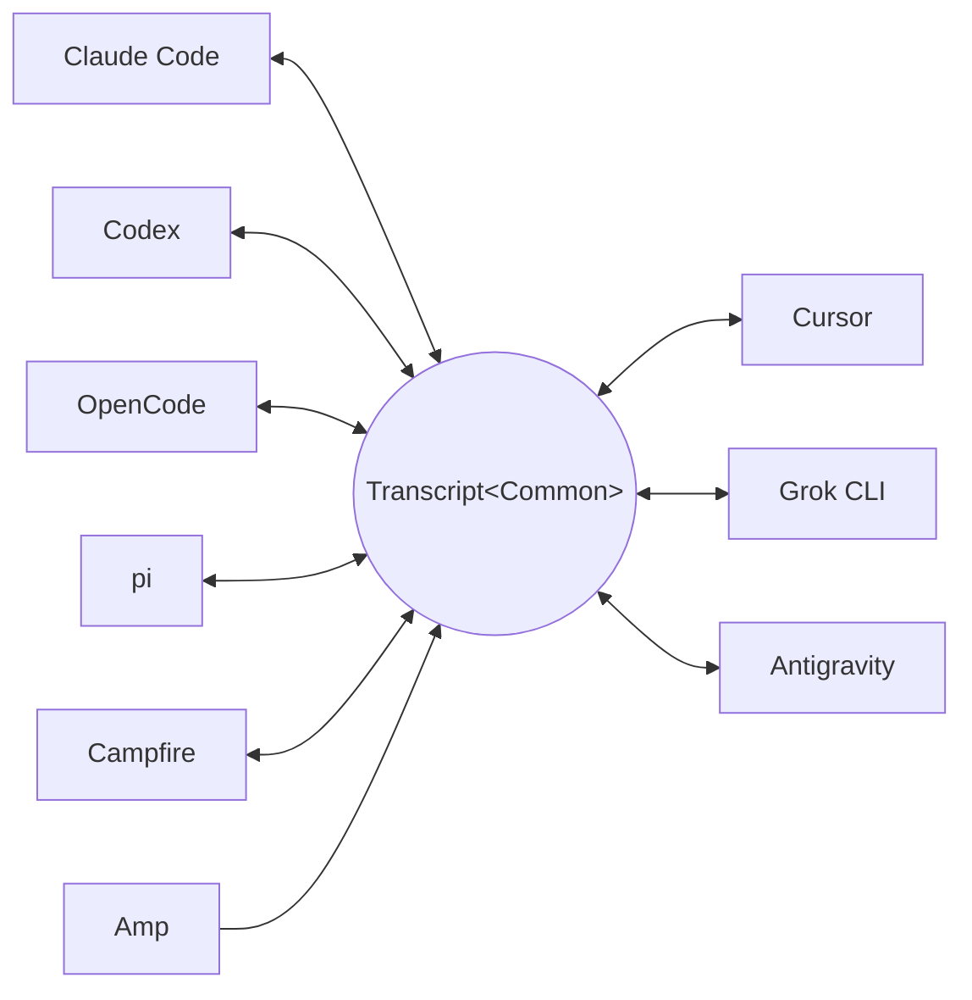

<p align="center">
  <picture>
    <source media="(prefers-color-scheme: dark)" srcset="docs/assets/wordmark-dark.svg">
    
  </picture>
</p>

<p align="center">txcript — библиотека для переноса сессий между кодинг-агентами</p>

<p align="center">
  <a href="README.md">English</a> | <a href="README.ja.md">日本語</a> | <a href="README.zh-CN.md">简体中文</a> | <a href="README.zh-TW.md">繁體中文</a> | <a href="README.ko.md">한국어</a> | <a href="README.de.md">Deutsch</a> | <a href="README.es.md">Español</a> | <a href="README.fr.md">Français</a> | <a href="README.it.md">Italiano</a> | <a href="README.pt-BR.md">Português (Brasil)</a> | Русский
</p>

<p align="center">
  <a href="https://crates.io/crates/txcript"></a>
  <a href="https://www.npmjs.com/package/txcript"></a>
  <a href="https://docs.rs/txcript"></a>
  <a href="https://github.com/skillsynchq/txcript/actions/workflows/ci.yml"></a>
  <a href="LICENSE"></a>
</p>

<p align="center">
  <a href="https://claude.com/claude-code"></a>
  &nbsp;&nbsp;&nbsp;&nbsp;&nbsp;&nbsp;
  <a href="https://github.com/openai/codex"></a>
  &nbsp;&nbsp;&nbsp;&nbsp;&nbsp;&nbsp;
  <a href="https://opencode.ai"></a>
  &nbsp;&nbsp;&nbsp;&nbsp;&nbsp;&nbsp;
  <a href="https://pi.dev"></a>
  &nbsp;&nbsp;&nbsp;&nbsp;&nbsp;&nbsp;
  <a href="https://cursor.com"></a>
</p>

Начните сессию в Claude Code, упритесь в лимит использования или в тупик — и
продолжите её в Codex, с полной историей разговора, рассуждений и вызовов
инструментов:

```console
$ txcript list
  claude_code   2h ago   fix relay reconnect bug          9f3a21…
  codex         1d ago   wire up usage accounting         c41b8d…
  opencode      3d ago   migrate store to sqlite          77e0f2…

$ txcript continue 9f3a21 --with codex    # re-synthesize into Codex, then launch it
```

txcript отображает нативный формат транскрипта каждого harness через
типизированную общую модель. Нативные загрузка и сохранение побайтово точны,
без потерь; конвертация между harness'ами сохраняет сообщения, рассуждения,
вызовы инструментов, их результаты, изображения, метаданные и данные об
использовании токенов, где они доступны. Проект поставляется как
**библиотека на Rust**, **CLI** и готовый **WASM-модуль** для Bun, Node и
браузеров.

## Основные возможности

- **9 harness'ов, одна модель** — каждый формат конвертируется через
  `Transcript<Common>`, поэтому добавление нового harness сразу связывает его
  со всеми остальными.
- **Побайтово точные round-trip'ы** — загрузка и сохранение сессии в её
  собственном формате воспроизводит её байт в байт.
- **Продолжайте где угодно** — `txcript continue <id> --with <harness>`
  переписывает сессию в нативный формат другого harness и запускает его.
  Оригинал никогда не изменяется.
- **Поиск по всему** — нечёткий и подстроковый поиск по всем сессиям на
  машине (синтаксис в стиле fzf, на основе [nucleo](https://github.com/helix-editor/nucleo)):
  как библиотечный API, разовый запрос из CLI или интерактивный picker.
- **MCP-сервер** — `txcript mcp` предоставляет read-only-инструменты
  `list_sessions`, `search_sessions` и `read_session`, так что агенты могут
  использовать прошлые сессии как контекст.
- **Задокументированные форматы** — формат хранения каждого harness описан в
  [`docs/formats/`](docs/formats), с указанием источника каждого утверждения
  (официальная документация, permalink'и на исходный код или заметки по
  реверс-инжинирингу).

## Поддерживаемые harness'ы

Каждый harness конвертируется через одну и ту же каноническую модель, поэтому
добавление нового сразу связывает его со всеми остальными:



Обнаружение, вывод списка, поиск, `view` и побайтово точные нативные
round-trip'ы работают для всех девяти. Строковые id — это то, что принимают
CLI и WASM API.

| Harness | id | Сессии на диске | Нативный формат | Конвертация | Продолжение в | Док. |
|---|---|---|---|:---:|:---:|---|
| [Claude Code](https://claude.com/claude-code) | `claude_code` | `~/.claude/projects/` | JSONL | ⇄ | ✓ | [спецификация](docs/formats/claude-code.md) |
| [Codex](https://github.com/openai/codex) | `codex` | `~/.codex/sessions/` | rollout JSONL | ⇄ | ✓ | [спецификация](docs/formats/codex.md) |
| [OpenCode](https://opencode.ai) | `opencode` | `~/.local/share/opencode/opencode.db` | SQLite | ⇄ | ✓ | [спецификация](docs/formats/opencode.md) |
| [pi](https://pi.dev) | `pi` | `~/.pi/agent/sessions/` | JSONL | ⇄ | ✓ | [спецификация](docs/formats/pi.md) |
| Campfire | `campfire` | `~/.campfire/agent/sessions/` | JSONL | ⇄ | ✓ | [спецификация](docs/formats/campfire.md) |
| [Cursor](https://cursor.com) | `cursor` | `~/.cursor/chats/` | SQLite (`store.db`) | ⇄ | ✓ | [спецификация](docs/formats/cursor.md) |
| [Grok CLI](https://github.com/xai-org/grok-build) | `grok` | `~/.grok/sessions/` | каталог сессии (JSON) | ⇄ | ✓ | [спецификация](docs/formats/grok.md) |
| [Amp](https://ampcode.com) | `amp` | `~/.local/share/amp/threads/` | JSON треда | → | — <sup>1</sup> | [спецификация](docs/formats/amp.md) |
| [Antigravity](https://antigravity.google) | `antigravity` | `~/.gemini/antigravity-cli/` | SQLite (protobuf) | ⇄ | ✓ | [спецификация](docs/formats/antigravity.md) |

<sup>1</sup> Треды Amp хранятся на сервере, а у CLI нет импорта: сессии
конвертируются *из* Amp, но продолжить их в нём нельзя.

## Установка

**CLI** (устанавливает бинарник `txcript`):

```sh
cargo install --git https://github.com/skillsynchq/txcript txcript-cli
# or from a checkout: cargo install --path cli
```

**Библиотека Rust**:

```sh
cargo add txcript
```

**JS / TS** (готовый WASM, Rust-тулчейн не нужен):

```sh
bun add txcript     # or: npm install txcript
```

## CLI

Найдите локальные сессии и продолжите любую из них в любом harness:

```sh
txcript list                             # local sessions across every harness
txcript continue <id>[#range]            # continue <id>, then launch its harness
    [--with <harness>]                    #   ...continuing in <harness> instead
    [--from <harness>]                    #   scope the id lookup to one harness
    [--out <dir>]                         #   write under <dir>; implies --no-resume
    [--no-resume]                         #   write the session but don't launch
txcript view <id>[#range]                # print a session as compact text
    [--from <harness>]                    #   scope the id lookup to one harness
```

`continue` по завершении передаёт терминал harness'у (в Unix — через `exec`).
Продолжение в том же harness возобновляет оригинал на месте; `--with` сначала
пересинтезирует сессию в нативный формат другого harness. При продолжении в
другом harness исходная сессия остаётся там, где была: записывается всегда
копия; источник никогда не изменяется и не удаляется. Команду запуска для
каждого harness можно переопределить через `TRANSCRIPT_<HARNESS>_RESUME_CMD`
(шаблон с `{id}`), например `TRANSCRIPT_CODEX_RESUME_CMD="codex resume {id}"`.

`view` печатает экономную по токенам текстовую проекцию, где линия
`── #N ──` нумерует каждое сообщение. `#range` задаёт диапазон сообщений
(нумерация с 1, границы включительно) — `abc#7` — это сообщение 7,
`abc#5-12`, `abc#5-` (с 5-го и дальше), `abc#-10` (по 10-е) — и напечатанные
номера — это именно те, которыми оперируют диапазоны: на что смотрите, на то
и ссылаетесь. `continue` принимает тот же суффикс и продолжает только эти
сообщения как новую сессию; диапазоны, отрезающие вызов инструмента от его
результата, отклоняются с подсказкой ближайшего допустимого диапазона.

### Поиск

```sh
txcript query 'relay bug'                # one-shot: ranked hits, highlighted
txcript query                            # fzf-style picker; Enter continues
    [--from <harness>]                   #   search only <harness> (default: all)
    [--with <harness>]                   #   continue the pick in <harness>
```

Picker не требует зависимостей (ANSI в raw-режиме): набирайте текст для
фильтрации с нечётким синтаксисом в стиле fzf, стрелки / ctrl-p/n —
перемещение, Enter — продолжить выбранную сессию в её родном harness (или в
указанном через `--with`), Esc — отмена. Каждая строка показывает, какой тип
содержимого совпал — текст пользователя, текст ассистента, размышления,
вызов инструмента, вывод инструмента или метаданные сессии.

### MCP-сервер

```sh
txcript mcp                              # stdio transport
```

Предоставляет ровно три read-only-инструмента; их необязательные фильтры
совпадают с CLI:

- `list_sessions(from?, cwd?)`
- `search_sessions(pattern, from?, cwd?)`
- `read_session(id, from?)`

Если `from` не указан, включаются все harness'ы. Если не указан `cwd`, фильтр
по каталогу не применяется — попадают и сессии без записанного рабочего
каталога; если `cwd` задан, такие сессии не совпадают.

### Автодополнение shell

```sh
txcript completion zsh > ~/.zfunc/_txcript      # or wherever your fpath looks
source <(txcript completion bash)               # bash, ad hoc
txcript completion fish > ~/.config/fish/completions/txcript.fish
```

## Библиотека Rust

```toml
[dependencies]
txcript = "0.5"
# Drops the OpenCode SQLite store (rusqlite); the OpenCode codec stays available.
# txcript = { version = "0.5", default-features = false }
```

Три слоя, от меньшего к большему:

- `Codec` — `to_common` / `from_common` для каждого harness;
  `convert::<A, B>` связывает их через каноническую модель.
- `TextCodec` — `from_text` / `to_text`: парсинг и рендеринг нативного текста
  сессии harness, без I/O.
- `Store` — обнаружение/загрузка/сохранение поверх реального бэкенда
  (каталоги сессий или базы SQLite для OpenCode и Cursor).

Конвертация в памяти (без файловой системы):

```rust
use txcript::harness::{claude_code, codex};
use txcript::{Codec, TextCodec, convert};

let claude = claude_code::ClaudeCode::from_text(jsonl_text)?;          // Transcript<ClaudeCode>
let codex = convert::<claude_code::ClaudeCode, codex::Codex>(&claude)?; // Transcript<Codex>
let codex_text = codex::Codex::to_text(&codex)?;                       // native rollout JSONL
```

Или через диск с помощью `Store`:

```rust
use txcript::harness::{claude_code, codex};
use txcript::{Store, convert};

let store = claude_code::ClaudeStore::default_root().expect("home dir");
let found = store.discover()?;                       // cheap metadata scan
let claude = store.load(&found[0].reference)?;       // Transcript<ClaudeCode>

let codex = convert::<_, codex::Codex>(&claude)?;
codex::CodexStore::default_root().expect("home dir").save(&codex)?;  // resumable on disk
```

Каноническая модель — `Transcript<Common>`: `Meta` + `Vec<Message>`, где
`Message` содержит типизированные блоки `Block` (`Text`, `Thinking`,
`ToolUse`, `ToolResult`, `Image`) и типизированный enum `Tool`.

Slash-команда, которую пользователь выполнил в harness, — это
`Tool::Command` в пользовательском ходе, а то, что harness вывел в ответ, —
парный `ToolResult`; поэтому `/release patch` читается как вызов, а не как та
разметка, в которой harness случайно её записал. Канонический признак —
ведущий `/`: ни одно имя инструмента, видимое модели, с него не начинается.
Шаблонный текст, который harness каждый раз генерирует сам (примечание
Claude Code о локальных командах), в модель не попадает.

### Поиск (фича `search`, включена по умолчанию)

`txcript::search` поддерживает нечёткий и подстроковый поиск по транскриптам
через [nucleo](https://github.com/helix-editor/nucleo). Разовый поиск:

```rust
use txcript::search::{Query, search};

let hits = search(&common, &Query::fuzzy("relay bug"));   // fzf syntax: 'exact ^prefix !not
for hit in hits {
    // hit.origin: User | Assistant | Thinking | ToolUse | ToolResult | Meta
    // hit.span addresses the message; hit.highlights are char ranges into hit.line
    let messages = common.fragment(&hit.span);            // zero-copy: Option<&[Message]>
}
```

Для поиска в стиле picker'а постройте `Index` один раз и запрашивайте его на
каждое нажатие клавиши:

```rust
use txcript::search::{DocKey, Index, Query};

let mut index = Index::new();
index.insert(DocKey { harness, id }, &common);   // re-insert replaces; caller owns refresh
let matches = index.query(&Query::fuzzy("srch")); // ranked docs, best lines as hits
```

Пустой паттерн возвращает документы от новых к старым. Вывод инструментов по
умолчанию исключён; чтобы включить его, используйте `Origin::ALL`.
`Query.harnesses`, `Query.limit` и `Query.hits_per_doc` сужают результаты.

### Текстовая проекция

`txcript::text::to_text(&common)` — односторонняя, экономная по токенам
проекция `Transcript<Common>` для использования в качестве контекста LLM. Она
сохраняет сообщения, текст рассуждений и компактные вызовы и результаты
инструментов, опуская нужные только для реплея данные: зашифрованные
рассуждения, учёт использования токенов и встроенные байты изображений.
`to_text_fragment(&common, &span)` рендерит `Span` тела в том же формате с
линиями `── #N ──`, несущими порядковый номер (с 1) каждого сообщения в
полной сессии — ту самую нумерацию, которую печатает `txcript view`.

## WASM-модуль (Bun / Node / браузеры)

Чистый кодек компилируется в WebAssembly; весь I/O выполняет JS-хост,
обращаясь к модулю только за преобразованием. Слой `Store` (файловая система,
SQLite, подпроцессы) остаётся нативным и исключён из WASM-сборки. npm-пакет
поставляется с уже собранным wasm:

```sh
bun add txcript     # or: npm install txcript
```

```ts
import { convert, toCommon, fromCommon, harnesses } from "txcript";
import { readFileSync, writeFileSync } from "node:fs";

const input = readFileSync("rollout.jsonl", "utf8");

// native -> native (e.g. a Codex rollout into Claude Code's JSONL)
writeFileSync("session.jsonl", convert(input, "codex", "claude_code"));

// canonical view, and back
const common = JSON.parse(toCommon(input, "codex"));   // { meta, messages }
const pi = fromCommon(JSON.stringify(common), "pi");

harnesses(); // ["claude_code","codex","opencode","pi","campfire","cursor","grok","amp","antigravity"]
```

Текст на входе / текст на выходе: `input` — это нативный текст сессии harness
(JSONL для claude_code/codex/pi/campfire, JSON из `opencode export` для
opencode, JSON-экспорт `store.db` Cursor для cursor, JSON-бандл файлов
каталога сессии для grok, JSON-документ треда — в форме
`amp threads export` — для amp и JSON-дамп базы данных разговора —
protobuf-блобы шагов в hex-кодировке — для antigravity); результат — нативный
текст целевого формата. Неверные имена harness или неразбираемый ввод бросают
JS-`Error`.

Чтобы собрать wasm из исходников:

```sh
git clone https://github.com/skillsynchq/txcript.git
cd txcript
bun run setup        # once: wasm target + wasm-bindgen-cli
bun run build        # produces ./pkg
```

## Документация форматов

Не все эти форматы транскриптов задокументированы их разработчиками. В
[`docs/formats/`](docs/formats) есть по одному документу на каждый harness —
где сессии лежат на диске, как их находит механизм обнаружения, разбор каждой
части формата и его особенности — и каждое утверждение снабжено указанием
источника: официальная документация, собственный открытый код сериализации
harness (со ссылками, закреплёнными за коммитом) или реверс-инжиниринг.

## Разработка

```sh
cargo test                                          # native suite
cargo test --no-default-features                    # without the SQLite store
bun run build && bun examples/convert.ts <file> <from> <to>
```

Бинарник живёт в отдельном workspace-крейте (`cli/`, пакет `txcript-cli`),
поэтому его зависимости (clap) никогда не затрагивают потребителей
библиотеки.

## Лицензия

[Apache-2.0](LICENSE)
