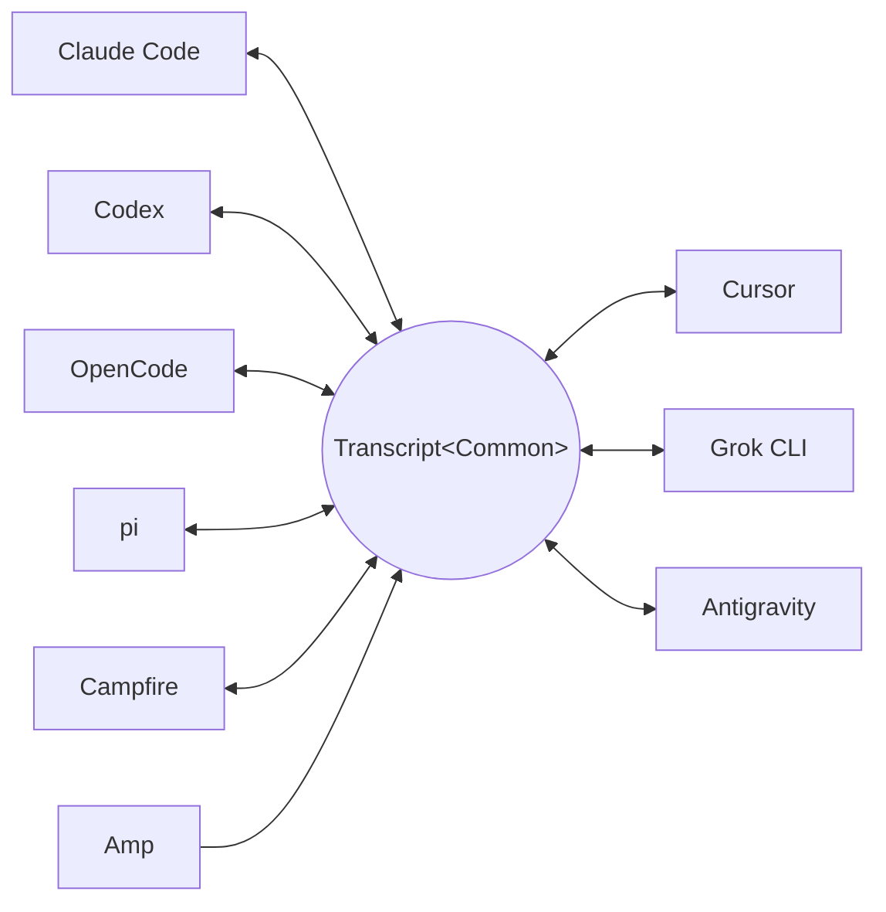

<p align="center">
  <picture>
    <source media="(prefers-color-scheme: dark)" srcset="docs/assets/wordmark-dark.svg">
    
  </picture>
</p>

<p align="center">txcript 是一个在编程智能体之间迁移会话的库。</p>

<p align="center">
  <a href="README.md">English</a> | <a href="README.ja.md">日本語</a> | 简体中文 | <a href="README.zh-TW.md">繁體中文</a> | <a href="README.ko.md">한국어</a> | <a href="README.de.md">Deutsch</a> | <a href="README.es.md">Español</a> | <a href="README.fr.md">Français</a> | <a href="README.it.md">Italiano</a> | <a href="README.pt-BR.md">Português (Brasil)</a> | <a href="README.ru.md">Русский</a>
</p>

<p align="center">
  <a href="https://crates.io/crates/txcript"></a>
  <a href="https://www.npmjs.com/package/txcript"></a>
  <a href="https://docs.rs/txcript"></a>
  <a href="https://github.com/skillsynchq/txcript/actions/workflows/ci.yml"></a>
  <a href="LICENSE"></a>
</p>

<p align="center">
  <a href="https://claude.com/claude-code"></a>
  &nbsp;&nbsp;&nbsp;&nbsp;&nbsp;&nbsp;
  <a href="https://github.com/openai/codex"></a>
  &nbsp;&nbsp;&nbsp;&nbsp;&nbsp;&nbsp;
  <a href="https://opencode.ai"></a>
  &nbsp;&nbsp;&nbsp;&nbsp;&nbsp;&nbsp;
  <a href="https://pi.dev"></a>
  &nbsp;&nbsp;&nbsp;&nbsp;&nbsp;&nbsp;
  <a href="https://cursor.com"></a>
</p>

在 Claude Code 中开始一个会话，遇到用量限制或卡壳时，换到 Codex 里接着做 —
完整的对话、推理和工具历史原样保留：

```console
$ txcript list
  claude_code   2h ago   fix relay reconnect bug          9f3a21…
  codex         1d ago   wire up usage accounting         c41b8d…
  opencode      3d ago   migrate store to sqlite          77e0f2…

$ txcript continue 9f3a21 --with codex    # re-synthesize into Codex, then launch it
```

txcript 通过一个带类型的公共模型来映射各个 harness 的原生会话记录格式。
原生加载/保存做到字节级无损；跨 harness 转换会尽可能保留消息、推理、
工具调用、工具结果、图像、元数据和用量信息。它以 **Rust 库**、**CLI**
和面向 Bun、Node 与浏览器的预编译 **WASM 模块** 三种形式发布。

## 亮点

- **9 个 harness，一个模型** — 所有格式都经由 `Transcript<Common>` 相互转换，
  因此新增一个 harness 就等于把它接入其他所有 harness。
- **字节级无损往返** — 以会话自身的格式加载并保存，可以原样复现。
- **随处继续** — `txcript continue <id> --with <harness>` 会把会话重写为另一个
  harness 的原生格式并启动它。原始会话绝不会被修改。
- **搜索一切** — 对本机上的所有会话做模糊/子串搜索（fzf 风格语法，
  由 [nucleo](https://github.com/helix-editor/nucleo) 驱动），可作为库 API、
  一次性 CLI 查询或交互式选择器使用。
- **MCP 服务器** — `txcript mcp` 暴露只读的 `list_sessions`、
  `search_sessions` 和 `read_session` 工具，让智能体可以把过往会话作为
  上下文来挖掘。
- **格式文档齐全** — 每个 harness 的磁盘格式都在
  [`docs/formats/`](docs/formats) 中有完整记述，且每条论断都注明出处
  （官方文档、源码 permalink 或逆向工程笔记）。

## 支持的 harness

每个 harness 都经由同一个规范模型转换，因此新增一个 harness 就等于把它
接入其他所有 harness：



发现、列表、搜索、`view` 以及字节级无损的原生往返对全部九个 harness
都可用。CLI 和 WASM API 接受的就是这些字符串 id。

| Harness | id | 磁盘上的会话 | 原生格式 | 转换 | 可继续到 | 文档 |
|---|---|---|---|:---:|:---:|---|
| [Claude Code](https://claude.com/claude-code) | `claude_code` | `~/.claude/projects/` | JSONL | ⇄ | ✓ | [规格](docs/formats/claude-code.md) |
| [Codex](https://github.com/openai/codex) | `codex` | `~/.codex/sessions/` | rollout JSONL | ⇄ | ✓ | [规格](docs/formats/codex.md) |
| [OpenCode](https://opencode.ai) | `opencode` | `~/.local/share/opencode/opencode.db` | SQLite | ⇄ | ✓ | [规格](docs/formats/opencode.md) |
| [pi](https://pi.dev) | `pi` | `~/.pi/agent/sessions/` | JSONL | ⇄ | ✓ | [规格](docs/formats/pi.md) |
| Campfire | `campfire` | `~/.campfire/agent/sessions/` | JSONL | ⇄ | ✓ | [规格](docs/formats/campfire.md) |
| [Cursor](https://cursor.com) | `cursor` | `~/.cursor/chats/` | SQLite (`store.db`) | ⇄ | ✓ | [规格](docs/formats/cursor.md) |
| [Grok CLI](https://github.com/xai-org/grok-build) | `grok` | `~/.grok/sessions/` | 会话目录（JSON） | ⇄ | ✓ | [规格](docs/formats/grok.md) |
| [Amp](https://ampcode.com) | `amp` | `~/.local/share/amp/threads/` | 线程 JSON | → | — <sup>1</sup> | [规格](docs/formats/amp.md) |
| [Antigravity](https://antigravity.google) | `antigravity` | `~/.gemini/antigravity-cli/` | SQLite (protobuf) | ⇄ | ✓ | [规格](docs/formats/antigravity.md) |

<sup>1</sup> Amp 的线程保存在服务端，且 CLI 没有导入功能：会话可以*从*
Amp 转换，但无法继续到 Amp 中。

## 安装

**CLI**（安装 `txcript` 二进制）：

```sh
cargo install --git https://github.com/skillsynchq/txcript txcript-cli
# or from a checkout: cargo install --path cli
```

**Rust 库**：

```sh
cargo add txcript
```

**JS / TS**（预编译 WASM，无需 Rust 工具链）：

```sh
bun add txcript     # or: npm install txcript
```

## CLI

发现本地会话，并在任意 harness 中继续其中一个：

```sh
txcript list                             # local sessions across every harness
txcript continue <id>[#range]            # continue <id>, then launch its harness
    [--with <harness>]                    #   ...continuing in <harness> instead
    [--from <harness>]                    #   scope the id lookup to one harness
    [--out <dir>]                         #   write under <dir>; implies --no-resume
    [--no-resume]                         #   write the session but don't launch
txcript view <id>[#range]                # print a session as compact text
    [--from <harness>]                    #   scope the id lookup to one harness
```

`continue` 完成后会把终端交给对应的 harness（在 Unix 上通过 `exec`）。
同 harness 的 continue 会就地恢复原会话；`--with` 则会先把会话重新合成为
另一个 harness 的原生格式。跨 harness 的 continue 不会动原会话 —
写出的始终是一份副本；源会话绝不会被修改或删除。可通过
`TRANSCRIPT_<HARNESS>_RESUME_CMD`（一个 `{id}` 模板）按 harness 覆盖
启动命令，例如 `TRANSCRIPT_CODEX_RESUME_CMD="codex resume {id}"`。

`view` 会打印一份注重 token 开销的文本投影，用 `── #N ──` 分隔线为每条
消息编号。`#range` 表示一个从 1 开始、两端闭合的消息范围 — `abc#7` 是
第 7 条消息，`abc#5-12`、`abc#5-`（从第 5 条起）、`abc#-10`（到第 10 条
为止）— 打印出的序号正是范围所使用的序号，所见即所引。`continue` 接受
同样的后缀，只把这些消息作为新会话继续；会把工具调用与其结果拆开的
范围会被拒绝，并给出最接近的有效范围建议。

### 搜索

```sh
txcript query 'relay bug'                # one-shot: ranked hits, highlighted
txcript query                            # fzf-style picker; Enter continues
    [--from <harness>]                   #   search only <harness> (default: all)
    [--with <harness>]                   #   continue the pick in <harness>
```

选择器不依赖任何第三方库（raw 模式 ANSI）：输入即可用 fzf 风格的模糊
语法过滤，用方向键 / ctrl-p/n 移动，Enter 在其原 harness（或 `--with`
指定的 harness）中继续所选会话，Esc 取消。每一行都会显示匹配到的内容
类型 — 用户文本、助手文本、思考、工具调用、工具输出或会话元数据。

### MCP 服务器

```sh
txcript mcp                              # stdio transport
```

仅暴露三个只读工具；其可选过滤参数与 CLI 一致：

- `list_sessions(from?, cwd?)`
- `search_sessions(pattern, from?, cwd?)`
- `read_session(id, from?)`

省略 `from` 时会包含所有 harness。省略 `cwd` 时不做目录过滤，包括没有
记录工作目录的会话；指定 `cwd` 时，这类会话不会被匹配。

### Shell 补全

```sh
txcript completion zsh > ~/.zfunc/_txcript      # or wherever your fpath looks
source <(txcript completion bash)               # bash, ad hoc
txcript completion fish > ~/.config/fish/completions/txcript.fish
```

## Rust 库

```toml
[dependencies]
txcript = "0.5"
# Drops the OpenCode SQLite store (rusqlite); the OpenCode codec stays available.
# txcript = { version = "0.5", default-features = false }
```

三个层次，由小到大：

- `Codec` — 每个 harness 的 `to_common` / `from_common`；`convert::<A, B>`
  通过规范模型把它们串联起来。
- `TextCodec` — `from_text` / `to_text`：解析/渲染 harness 的原生会话文本，
  不做任何 I/O。
- `Store` — 针对真实后端（会话目录，或 OpenCode 与 Cursor 的 SQLite
  数据库）做发现/加载/保存。

在内存中转换（不经过文件系统）：

```rust
use txcript::harness::{claude_code, codex};
use txcript::{Codec, TextCodec, convert};

let claude = claude_code::ClaudeCode::from_text(jsonl_text)?;          // Transcript<ClaudeCode>
let codex = convert::<claude_code::ClaudeCode, codex::Codex>(&claude)?; // Transcript<Codex>
let codex_text = codex::Codex::to_text(&codex)?;                       // native rollout JSONL
```

或者通过 `Store` 走磁盘：

```rust
use txcript::harness::{claude_code, codex};
use txcript::{Store, convert};

let store = claude_code::ClaudeStore::default_root().expect("home dir");
let found = store.discover()?;                       // cheap metadata scan
let claude = store.load(&found[0].reference)?;       // Transcript<ClaudeCode>

let codex = convert::<_, codex::Codex>(&claude)?;
codex::CodexStore::default_root().expect("home dir").save(&codex)?;  // resumable on disk
```

规范模型是 `Transcript<Common>` — 即 `Meta` + `Vec<Message>`，其中
`Message` 持有带类型的 `Block`（`Text`、`Thinking`、`ToolUse`、
`ToolResult`、`Image`）和一个带类型的 `Tool` 枚举。

用户在 harness 中运行的斜杠命令会成为用户轮次上的一个 `Tool::Command`，
harness 打印回来的内容则作为与之配对的 `ToolResult` — 因此
`/release patch` 读起来是一次调用，而不是 harness 恰好用来记录它的那种
标记格式。规范层面靠开头的 `/` 来标识：任何面向模型的工具名都不会以它
开头。harness 自行重新生成的样板内容（如 Claude Code 的 local-command
提示）不会保留到模型中。

### 搜索（`search` feature，默认启用）

`txcript::search` 通过 [nucleo](https://github.com/helix-editor/nucleo)
支持对会话记录的模糊与子串搜索。一次性搜索：

```rust
use txcript::search::{Query, search};

let hits = search(&common, &Query::fuzzy("relay bug"));   // fzf syntax: 'exact ^prefix !not
for hit in hits {
    // hit.origin: User | Assistant | Thinking | ToolUse | ToolResult | Meta
    // hit.span addresses the message; hit.highlights are char ranges into hit.line
    let messages = common.fragment(&hit.span);            // zero-copy: Option<&[Message]>
}
```

若要做选择器式搜索，先构建一次 `Index`，然后随每次按键查询：

```rust
use txcript::search::{DocKey, Index, Query};

let mut index = Index::new();
index.insert(DocKey { harness, id }, &common);   // re-insert replaces; caller owns refresh
let matches = index.query(&Query::fuzzy("srch")); // ranked docs, best lines as hits
```

空模式会按最新在前返回文档。工具输出默认被排除；用 `Origin::ALL` 可以
包含它们。`Query.harnesses`、`Query.limit` 和 `Query.hits_per_doc` 用来
收窄结果。

### 文本投影

`txcript::text::to_text(&common)` 是 `Transcript<Common>` 的一份单向、
注重 token 开销的投影，用作 LLM 上下文。它保留消息、推理文本和紧凑的
工具调用/结果，同时省略仅用于回放的载荷，例如加密推理、用量记账和
内联图像字节。`to_text_fragment(&common, &span)` 以同样的格式渲染正文的
一个 `Span`，`── #N ──` 分隔线携带每条消息在完整会话中从 1 开始的序号 —
也就是 `txcript view` 打印的编号。

## WASM 模块（Bun / Node / 浏览器）

纯 codec 部分编译为 WebAssembly；所有 I/O 由 JS 宿主负责，仅在需要转换
时调用进来。`Store` 层（文件系统、SQLite、子进程）保持原生实现，不包含
在 WASM 构建中。npm 包附带预编译好的 wasm：

```sh
bun add txcript     # or: npm install txcript
```

```ts
import { convert, toCommon, fromCommon, harnesses } from "txcript";
import { readFileSync, writeFileSync } from "node:fs";

const input = readFileSync("rollout.jsonl", "utf8");

// native -> native (e.g. a Codex rollout into Claude Code's JSONL)
writeFileSync("session.jsonl", convert(input, "codex", "claude_code"));

// canonical view, and back
const common = JSON.parse(toCommon(input, "codex"));   // { meta, messages }
const pi = fromCommon(JSON.stringify(common), "pi");

harnesses(); // ["claude_code","codex","opencode","pi","campfire","cursor","grok","amp","antigravity"]
```

文本进 / 文本出：`input` 是某个 harness 的原生会话文本
（claude_code/codex/pi/campfire 为 JSONL，opencode 为 `opencode export`
输出的 JSON，cursor 为 Cursor `store.db` 的 JSON 导出，grok 为会话目录中
各文件的 JSON 打包，amp 为线程 JSON 文档 — 即 `amp threads export` 的
形态，antigravity 为对话数据库的 JSON 转储 — 内含十六进制编码的
protobuf step blob）；结果是目标格式的原生文本。无效的 harness 名称或
无法解析的输入会抛出 JS `Error`。

若要改为从源码构建 wasm：

```sh
git clone https://github.com/skillsynchq/txcript.git
cd txcript
bun run setup        # once: wasm target + wasm-bindgen-cli
bun run build        # produces ./pkg
```

## 格式文档

这些会话记录格式并非都有官方文档。[`docs/formats/`](docs/formats) 为
每个 harness 提供一份文档 — 会话在磁盘上的位置、发现机制如何找到它们、
对格式各部分的逐一剖析及其怪癖 — 并且每条论断都标注了出处：官方文档、
harness 自身的开源序列化代码（附有锁定到具体 commit 的 permalink），
或逆向工程。

## 开发

```sh
cargo test                                          # native suite
cargo test --no-default-features                    # without the SQLite store
bun run build && bun examples/convert.ts <file> <from> <to>
```

二进制程序位于独立的 workspace crate（`cli/`，包名 `txcript-cli`）中，
因此它的依赖（clap）不会波及库的使用者。

## 许可证

[Apache-2.0](LICENSE)
