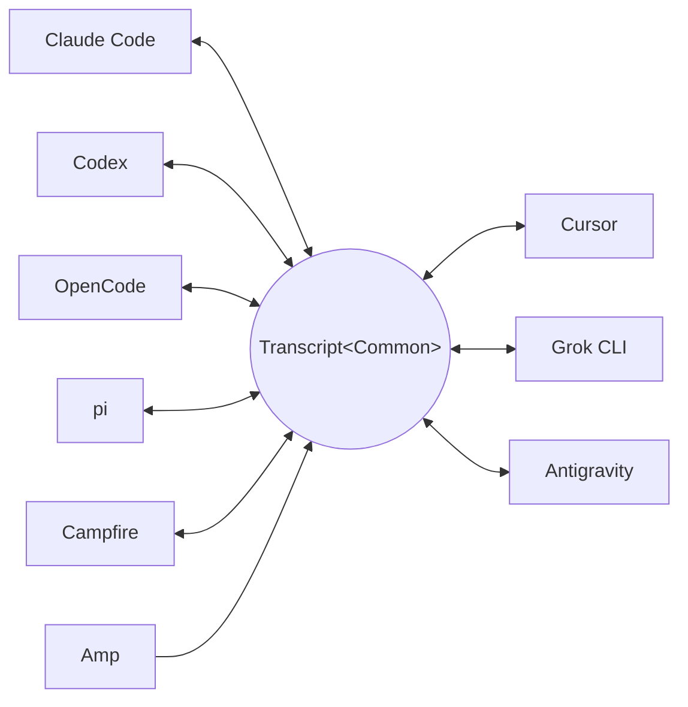

<p align="center">
  <picture>
    <source media="(prefers-color-scheme: dark)" srcset="docs/assets/wordmark-dark.svg">
    
  </picture>
</p>

<p align="center">一個在 coding agent 之間搬移工作階段的函式庫</p>

<p align="center">
  <a href="README.md">English</a> | <a href="README.ja.md">日本語</a> | <a href="README.zh-CN.md">简体中文</a> | 繁體中文 | <a href="README.ko.md">한국어</a> | <a href="README.de.md">Deutsch</a> | <a href="README.es.md">Español</a> | <a href="README.fr.md">Français</a> | <a href="README.it.md">Italiano</a> | <a href="README.pt-BR.md">Português (Brasil)</a> | <a href="README.ru.md">Русский</a>
</p>

<p align="center">
  <a href="https://crates.io/crates/txcript"></a>
  <a href="https://www.npmjs.com/package/txcript"></a>
  <a href="https://docs.rs/txcript"></a>
  <a href="https://github.com/skillsynchq/txcript/actions/workflows/ci.yml"></a>
  <a href="LICENSE"></a>
</p>

<p align="center">
  <a href="https://claude.com/claude-code"></a>
  &nbsp;&nbsp;&nbsp;&nbsp;&nbsp;&nbsp;
  <a href="https://github.com/openai/codex"></a>
  &nbsp;&nbsp;&nbsp;&nbsp;&nbsp;&nbsp;
  <a href="https://opencode.ai"></a>
  &nbsp;&nbsp;&nbsp;&nbsp;&nbsp;&nbsp;
  <a href="https://pi.dev"></a>
  &nbsp;&nbsp;&nbsp;&nbsp;&nbsp;&nbsp;
  <a href="https://cursor.com"></a>
</p>

在 Claude Code 中開始一個工作階段，碰到用量上限或卡關時，改用 Codex
接著做 — 完整的對話、推理與工具歷史通通保留：

```console
$ txcript list
  claude_code   2h ago   fix relay reconnect bug          9f3a21…
  codex         1d ago   wire up usage accounting         c41b8d…
  opencode      3d ago   migrate store to sqlite          77e0f2…

$ txcript continue 9f3a21 --with codex    # re-synthesize into Codex, then launch it
```

txcript 透過一個具型別的共同模型來對應各個 harness 的原生紀錄格式。
原生載入/儲存可做到位元組層級無損；跨 harness 轉換會在可用時保留訊息、
推理、工具呼叫、工具結果、圖片、中繼資料與用量資訊。它以
**Rust 函式庫**、**CLI**，以及供 Bun、Node 與瀏覽器使用的預先建置
**WASM 模組** 形式發佈。

## 特色

- **9 個 harness，一個模型** — 所有格式都經由 `Transcript<Common>` 相互
  轉換，因此新增一個 harness 就等於把它接上其他所有 harness。
- **位元組層級無損往返** — 以工作階段自身的格式載入並儲存，可以原樣重現。
- **隨處接續** — `txcript continue <id> --with <harness>` 會把工作階段改寫
  為另一個 harness 的原生格式並啟動它。原始工作階段絕不會被更動。
- **搜尋一切** — 對本機上的所有工作階段做模糊/子字串搜尋（fzf 風格語法，
  由 [nucleo](https://github.com/helix-editor/nucleo) 驅動），可作為函式庫
  API、單次 CLI 查詢或互動式選擇器使用。
- **MCP 伺服器** — `txcript mcp` 提供唯讀的 `list_sessions`、
  `search_sessions` 與 `read_session` 工具，讓 agent 能把過往的工作階段
  當作上下文來挖掘。
- **格式文件完備** — 每個 harness 的磁碟格式都寫在
  [`docs/formats/`](docs/formats)，且每項主張都註明出處（官方文件、
  原始碼 permalink 或逆向工程筆記）。

## 支援的 harness

每個 harness 都經由同一個標準模型轉換，因此新增一個 harness 就等於把它
接上其他所有 harness：



探索、列表、搜尋、`view` 以及位元組層級無損的原生往返對全部九個
harness 都適用。CLI 與 WASM API 使用的就是這些字串 id。

| Harness | id | 磁碟上的工作階段 | 原生格式 | 轉換 | 可接續至 | 文件 |
|---|---|---|---|:---:|:---:|---|
| [Claude Code](https://claude.com/claude-code) | `claude_code` | `~/.claude/projects/` | JSONL | ⇄ | ✓ | [規格](docs/formats/claude-code.md) |
| [Codex](https://github.com/openai/codex) | `codex` | `~/.codex/sessions/` | rollout JSONL | ⇄ | ✓ | [規格](docs/formats/codex.md) |
| [OpenCode](https://opencode.ai) | `opencode` | `~/.local/share/opencode/opencode.db` | SQLite | ⇄ | ✓ | [規格](docs/formats/opencode.md) |
| [pi](https://pi.dev) | `pi` | `~/.pi/agent/sessions/` | JSONL | ⇄ | ✓ | [規格](docs/formats/pi.md) |
| Campfire | `campfire` | `~/.campfire/agent/sessions/` | JSONL | ⇄ | ✓ | [規格](docs/formats/campfire.md) |
| [Cursor](https://cursor.com) | `cursor` | `~/.cursor/chats/` | SQLite (`store.db`) | ⇄ | ✓ | [規格](docs/formats/cursor.md) |
| [Grok CLI](https://github.com/xai-org/grok-build) | `grok` | `~/.grok/sessions/` | 工作階段目錄（JSON） | ⇄ | ✓ | [規格](docs/formats/grok.md) |
| [Amp](https://ampcode.com) | `amp` | `~/.local/share/amp/threads/` | 對話串 JSON | → | — <sup>1</sup> | [規格](docs/formats/amp.md) |
| [Antigravity](https://antigravity.google) | `antigravity` | `~/.gemini/antigravity-cli/` | SQLite (protobuf) | ⇄ | ✓ | [規格](docs/formats/antigravity.md) |

<sup>1</sup> Amp 的對話串保存在伺服器端，且 CLI 沒有匯入功能：工作階段
可以*從* Amp 轉換，但無法接續至 Amp。

## 安裝

**CLI**（安裝 `txcript` 執行檔）：

```sh
cargo install --git https://github.com/skillsynchq/txcript txcript-cli
# or from a checkout: cargo install --path cli
```

**Rust 函式庫**：

```sh
cargo add txcript
```

**JS / TS**（預先建置的 WASM，無需 Rust 工具鏈）：

```sh
bun add txcript     # or: npm install txcript
```

## CLI

探索本機工作階段，並在任一 harness 中接續其中之一：

```sh
txcript list                             # local sessions across every harness
txcript continue <id>[#range]            # continue <id>, then launch its harness
    [--with <harness>]                    #   ...continuing in <harness> instead
    [--from <harness>]                    #   scope the id lookup to one harness
    [--out <dir>]                         #   write under <dir>; implies --no-resume
    [--no-resume]                         #   write the session but don't launch
txcript view <id>[#range]                # print a session as compact text
    [--from <harness>]                    #   scope the id lookup to one harness
```

`continue` 完成後會把終端機交給對應的 harness（在 Unix 上以 `exec`
執行）。同一 harness 的 continue 會就地恢復原工作階段；`--with` 則會先
將工作階段重新合成為另一個 harness 的原生格式。跨 harness 的 continue
不會更動原工作階段 — 寫出的永遠是一份副本；來源絕不會被修改或移除。
可透過 `TRANSCRIPT_<HARNESS>_RESUME_CMD`（`{id}` 樣板）針對各 harness
覆寫啟動指令，例如 `TRANSCRIPT_CODEX_RESUME_CMD="codex resume {id}"`。

`view` 會輸出一份節省 token 的文字投影，以 `── #N ──` 分隔線為每則訊息
編號。`#range` 指定一個從 1 起算、頭尾皆含的訊息範圍 — `abc#7` 是第 7
則訊息，`abc#5-12`、`abc#5-`（從第 5 則起）、`abc#-10`（到第 10 則為
止）— 印出的序號就是範圍所用的序號，所見即所指。`continue` 接受同樣的
後綴，只把這些訊息作為新的工作階段接續；會把工具呼叫與其結果拆開的
範圍會被拒絕，並建議最接近的有效範圍。

### 搜尋

```sh
txcript query 'relay bug'                # one-shot: ranked hits, highlighted
txcript query                            # fzf-style picker; Enter continues
    [--from <harness>]                   #   search only <harness> (default: all)
    [--with <harness>]                   #   continue the pick in <harness>
```

選擇器不依賴任何外部函式庫（raw 模式 ANSI）：輸入即可以 fzf 風格的模糊
語法過濾，以方向鍵 / ctrl-p/n 移動，Enter 在其原本的 harness（或
`--with` 指定者）中接續所選項目，Esc 取消。每一列都會顯示比對到的內容
種類 — 使用者文字、助理文字、思考、工具呼叫、工具輸出或工作階段中繼
資料。

### MCP 伺服器

```sh
txcript mcp                              # stdio transport
```

僅提供三個唯讀工具；其可選的篩選參數與 CLI 一致：

- `list_sessions(from?, cwd?)`
- `search_sessions(pattern, from?, cwd?)`
- `read_session(id, from?)`

省略 `from` 時會涵蓋所有 harness。省略 `cwd` 時不套用目錄篩選，包括
未記錄工作目錄的工作階段；指定 `cwd` 時，這類工作階段不會被比對到。

### Shell 自動補全

```sh
txcript completion zsh > ~/.zfunc/_txcript      # or wherever your fpath looks
source <(txcript completion bash)               # bash, ad hoc
txcript completion fish > ~/.config/fish/completions/txcript.fish
```

## Rust 函式庫

```toml
[dependencies]
txcript = "0.5"
# Drops the OpenCode SQLite store (rusqlite); the OpenCode codec stays available.
# txcript = { version = "0.5", default-features = false }
```

三個層次，由小到大：

- `Codec` — 各 harness 的 `to_common` / `from_common`；`convert::<A, B>`
  透過標準模型將它們串接起來。
- `TextCodec` — `from_text` / `to_text`：解析/輸出 harness 的原生工作階段
  文字，不涉及 I/O。
- `Store` — 針對實際後端（工作階段目錄，或 OpenCode 與 Cursor 的 SQLite
  資料庫）進行探索/載入/儲存。

在記憶體中轉換（不經過檔案系統）：

```rust
use txcript::harness::{claude_code, codex};
use txcript::{Codec, TextCodec, convert};

let claude = claude_code::ClaudeCode::from_text(jsonl_text)?;          // Transcript<ClaudeCode>
let codex = convert::<claude_code::ClaudeCode, codex::Codex>(&claude)?; // Transcript<Codex>
let codex_text = codex::Codex::to_text(&codex)?;                       // native rollout JSONL
```

或者透過 `Store` 經由磁碟：

```rust
use txcript::harness::{claude_code, codex};
use txcript::{Store, convert};

let store = claude_code::ClaudeStore::default_root().expect("home dir");
let found = store.discover()?;                       // cheap metadata scan
let claude = store.load(&found[0].reference)?;       // Transcript<ClaudeCode>

let codex = convert::<_, codex::Codex>(&claude)?;
codex::CodexStore::default_root().expect("home dir").save(&codex)?;  // resumable on disk
```

標準模型是 `Transcript<Common>` — 即 `Meta` + `Vec<Message>`，其中
`Message` 持有具型別的 `Block`（`Text`、`Thinking`、`ToolUse`、
`ToolResult`、`Image`）與一個具型別的 `Tool` 列舉。

使用者在 harness 中執行的斜線指令會成為使用者回合上的一個
`Tool::Command`，harness 回印的內容則作為與之配對的 `ToolResult` —
因此 `/release patch` 讀起來是一次呼叫，而不是 harness 恰好用來記錄它
的那種標記格式。標準層面以開頭的 `/` 作為標識：任何面向模型的工具名稱
都不會以它開頭。harness 自行重新產生的樣板內容（如 Claude Code 的
local-command 附註）不會保留到模型中。

### 搜尋（`search` feature，預設啟用）

`txcript::search` 透過 [nucleo](https://github.com/helix-editor/nucleo)
支援對紀錄的模糊與子字串搜尋。單次搜尋：

```rust
use txcript::search::{Query, search};

let hits = search(&common, &Query::fuzzy("relay bug"));   // fzf syntax: 'exact ^prefix !not
for hit in hits {
    // hit.origin: User | Assistant | Thinking | ToolUse | ToolResult | Meta
    // hit.span addresses the message; hit.highlights are char ranges into hit.line
    let messages = common.fragment(&hit.span);            // zero-copy: Option<&[Message]>
}
```

若要做選擇器式搜尋，先建立一次 `Index`，再於每次按鍵時查詢：

```rust
use txcript::search::{DocKey, Index, Query};

let mut index = Index::new();
index.insert(DocKey { harness, id }, &common);   // re-insert replaces; caller owns refresh
let matches = index.query(&Query::fuzzy("srch")); // ranked docs, best lines as hits
```

空的模式會以最新在前回傳文件。工具輸出預設被排除；使用 `Origin::ALL`
可將其納入。`Query.harnesses`、`Query.limit` 與 `Query.hits_per_doc`
可縮小結果範圍。

### 文字投影

`txcript::text::to_text(&common)` 是 `Transcript<Common>` 的一份單向、
節省 token 的投影，供作為 LLM 上下文使用。它保留訊息、推理文字與精簡的
工具呼叫/結果，同時省略僅供重播的內容，例如加密推理、用量統計與內嵌
圖片位元組。`to_text_fragment(&common, &span)` 以相同格式輸出內文的一個
`Span`，`── #N ──` 分隔線帶有每則訊息在完整工作階段中從 1 起算的序號 —
也就是 `txcript view` 印出的編號。

## WASM 模組（Bun / Node / 瀏覽器）

純 codec 部分編譯為 WebAssembly；所有 I/O 由 JS 宿主負責，僅在需要轉換
時呼叫進來。`Store` 層（檔案系統、SQLite、子行程）維持原生實作，不包含
在 WASM 建置中。npm 套件隨附預先建置的 wasm：

```sh
bun add txcript     # or: npm install txcript
```

```ts
import { convert, toCommon, fromCommon, harnesses } from "txcript";
import { readFileSync, writeFileSync } from "node:fs";

const input = readFileSync("rollout.jsonl", "utf8");

// native -> native (e.g. a Codex rollout into Claude Code's JSONL)
writeFileSync("session.jsonl", convert(input, "codex", "claude_code"));

// canonical view, and back
const common = JSON.parse(toCommon(input, "codex"));   // { meta, messages }
const pi = fromCommon(JSON.stringify(common), "pi");

harnesses(); // ["claude_code","codex","opencode","pi","campfire","cursor","grok","amp","antigravity"]
```

文字進 / 文字出：`input` 是某個 harness 的原生工作階段文字
（claude_code/codex/pi/campfire 為 JSONL，opencode 為 `opencode export`
輸出的 JSON，cursor 為 Cursor `store.db` 的 JSON 匯出，grok 為工作階段
目錄中各檔案的 JSON 打包，amp 為對話串 JSON 文件 — 即
`amp threads export` 的形態，antigravity 為對話資料庫的 JSON 傾印 —
內含十六進位編碼的 protobuf step blob）；結果是目標格式的原生文字。
無效的 harness 名稱或無法解析的輸入會擲回 JS `Error`。

若要改為從原始碼建置 wasm：

```sh
git clone https://github.com/skillsynchq/txcript.git
cd txcript
bun run setup        # once: wasm target + wasm-bindgen-cli
bun run build        # produces ./pkg
```

## 格式文件

這些紀錄格式並非都有官方文件。[`docs/formats/`](docs/formats) 為每個
harness 提供一份文件 — 工作階段在磁碟上的位置、探索機制如何找到它們、
對格式各部分的逐一剖析及其特殊之處 — 且每項主張都標註了出處：官方
文件、harness 自身的開源序列化程式碼（附有釘選到特定 commit 的
permalink），或逆向工程。

## 開發

```sh
cargo test                                          # native suite
cargo test --no-default-features                    # without the SQLite store
bun run build && bun examples/convert.ts <file> <from> <to>
```

執行檔位於獨立的 workspace crate（`cli/`，套件名 `txcript-cli`），因此
它的相依套件（clap）不會影響函式庫的使用者。

## 授權條款

[Apache-2.0](LICENSE)
